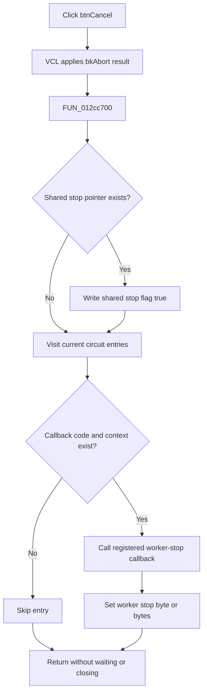

# btnCancel

> Analysis status: Reviewed from the recovered handler, form lifecycle, and multithread callers.

## Control

| Property | Recovered value |
| --- | --- |
| Form | MultiThreadPercentageDlg |
| Component path | MultiThreadPercentageDlg.pnlMain.btnCancel |
| Control class | TBitBtn |
| Caption | Not present in the recovered resource. |
| Hint | Not present in the recovered resource. |
| Text | Not present in the recovered resource. |
| Handler name | btnCancelClick |
| Handler address | 012cc700 |
| Graph node | `resource:dfm:MultiThreadPercentageDlg/MultiThreadPercentageDlg.pnlMain.btnCancel` |
| Handler node | `function:012cc700` |
| Graph layer | UI |

## What happens when clicked

`btnCancel` is the abort control for the modeless calculation-progress form. The recovered VCL path first applies the `bkAbort` button's configured modal result to its parent form and then dispatches `btnCancelClick`. The multithread callers show this form without a modal wait, so their stop condition does not depend on that modal result.

`FUN_012cc700` performs cooperative cancellation in two stages:

1. If the form has a cancellation-Boolean pointer at offset `+0x718`, it writes `true` through that pointer. Both recovered multithread callers pass the address of their own stop flag to the form constructor.
2. It visits each current circuit entry. The form stores a callback code pointer in the circuit-name list and stores the matching callback context in a parallel pointer list. If both values are non-null, the handler calls the callback with its context.

The registration trace identifies three callback targets. They set a general worker stop byte at context offset `+0x49c`; two variants also set a second stop byte at `+0x13b6` or `+0x13d8`. Thus, the shared flag stops the scheduling loops and the per-circuit callbacks signal work that is already active.

The handler skips the shared-flag write when no pointer was supplied. It also skips a circuit entry when its callback code or context is null. An empty circuit list only leaves the shared cancellation request in effect. The handler does not wait for workers, join threads, remove circuit rows, hide the form, or free the form. The recovered callers continue to process messages, wait until their active-worker count reaches zero, and then destroy the dialog. There is no local exception handler; a failed list read or indirect callback can prevent later entries from receiving the request.

## Click flow

## Handler evidence

- Source: [DecompiledSources/Tina16/functions/00000000012CC700__FUN_012cc700.c](../../../DecompiledSources/Tina16/functions/00000000012CC700__FUN_012cc700.c)
- Recovered role: Request cooperative cancellation and notify each registered active-circuit worker.
- Current graph summary: Handles 1 Delphi UI event: MultiThreadPercentageDlg.pnlMain.btnCancel.OnClick.
- Current graph behavior: Write the caller's shared stop flag when present, then call every non-null registered callback with its paired non-null context.
- Current graph evidence: The handler writes through form field `+0x718`, counts entries in `+0x738`, obtains callback code from each string-list object slot, reads the matching context from `+0x740`, and invokes the code pointer with that context.
- Complexity: simple
- Distinct outgoing calls: 1

## Direct calls

- `function:004aeac0` — Reads a pointer-list item after an index-range check. The handler uses it for each registered callback context.

The graph records only the direct helper call. The worker-stop callbacks are indirect calls through registered code pointers:

- [FUN_01320550](../../../DecompiledSources/Tina16/functions/0000000001320550__FUN_01320550.c) sets context bytes `+0x49c` and `+0x13b6` to `true`.
- [FUN_01390b40](../../../DecompiledSources/Tina16/functions/0000000001390B40__FUN_01390b40.c) sets context bytes `+0x49c` and `+0x13d8` to `true`.
- [FUN_013411e0](../../../DecompiledSources/Tina16/functions/00000000013411E0__FUN_013411e0.c) sets context byte `+0x49c` to `true`.

## Resource evidence

- Kind: bkAbort
- Modal result: Not present in the recovered resource.
- Checked state: Not present in the recovered resource.
- List items: Not present in the recovered resource.
- Image reference: Not present in the recovered resource.
- Extracted glyph: None.

## Nearby label candidates

Nearby labels are layout candidates only. They are not proof of behavior.

- Rank 1: 00:00:00 at distance 205.

## Analysis limits

- The recovered symbols do not give Delphi names for the three worker-stop callbacks or the fields that they set.
- The recovered code proves that the callbacks request a stop. It does not prove where each worker reads the stop bytes or how long termination takes.
- The UI evidence reports `Kind=bkAbort`, but it does not expose the button's numeric modal-result value. The modeless callers do not read a modal return value.
- The `00:00:00` label is the elapsed-time display. Its proximity does not add cancellation evidence.

## Supporting sources

- [Form constructor and cancellation-pointer assignment](../../../DecompiledSources/Tina16/functions/00000000012CC640__FUN_012cc640.c)
- [Form creation of the circuit-name and callback-context lists](../../../DecompiledSources/Tina16/functions/00000000012CC7B0__FUN_012cc7b0.c)
- [Circuit-entry registration](../../../DecompiledSources/Tina16/functions/00000000012CCA00__FUN_012cca00.c)
- [Callback code registration](../../../DecompiledSources/Tina16/functions/00000000012CCFF0__FUN_012ccff0.c)
- [Callback context registration](../../../DecompiledSources/Tina16/functions/00000000012CD080__FUN_012cd080.c)
- [First modeless multithread caller](../../../DecompiledSources/Tina16/functions/00000000012DA080__FUN_012da080.c)
- [Second modeless multithread caller](../../../DecompiledSources/Tina16/functions/000000000131AEF0__FUN_0131aef0.c)
- [Application-level programmatic cancellation path](../../../DecompiledSources/Tina16/functions/0000000001CA17F0__FUN_01ca17f0.c)
- [TBitBtn click dispatch](../../../DecompiledSources/Tina16/functions/000000000082B0E0__FUN_0082b0e0.c)
- [Inherited modal-result and event dispatch](../../../DecompiledSources/Tina16/functions/0000000000687F30__FUN_00687f30.c)
