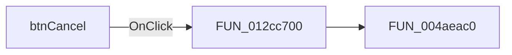

# btnCancel

> Analysis status: Pending individual source review.

## Control

| Property | Recovered value |
| --- | --- |
| Form | MultiThreadPercentageDlg |
| Component path | MultiThreadPercentageDlg.pnlMain.btnCancel |
| Control class | TBitBtn |
| Caption | Not present in the recovered resource. |
| Hint | Not present in the recovered resource. |
| Text | Not present in the recovered resource. |
| Handler name | btnCancelClick |
| Handler address | 012cc700 |
| Graph node | `resource:dfm:MultiThreadPercentageDlg/MultiThreadPercentageDlg.pnlMain.btnCancel` |
| Handler node | `function:012cc700` |
| Graph layer | UI |

## What happens when clicked

Pending individual analysis. An agent must read the recovered handler source and its relevant callees before it replaces this text.

## Click flow

## Handler evidence

- Source: [DecompiledSources/Tina16/functions/00000000012CC700__FUN_012cc700.c](../../../DecompiledSources/Tina16/functions/00000000012CC700__FUN_012cc700.c)
- Recovered role: Not present in the recovered resource.
- Current graph summary: Handles 1 Delphi UI event: MultiThreadPercentageDlg.pnlMain.btnCancel.OnClick.
- Current graph behavior: Not present in the recovered resource.
- Current graph evidence: Not present in the recovered resource.
- Complexity: simple
- Distinct outgoing calls: 1

## Direct calls

- `function:004aeac0` — FUN_004aeac0

## Resource evidence

- Kind: bkAbort
- Modal result: Not present in the recovered resource.
- Checked state: Not present in the recovered resource.
- List items: Not present in the recovered resource.
- Image reference: Not present in the recovered resource.
- Extracted glyph: None.

## Nearby label candidates

Nearby labels are layout candidates only. They are not proof of behavior.

- Rank 1: 00:00:00 at distance 205.

## Analysis limits

- Do not infer behavior from the control class, caption, hint, glyph, or nearby label alone.
- Do not replace the pending status until the handler source and relevant call path provide enough evidence.
