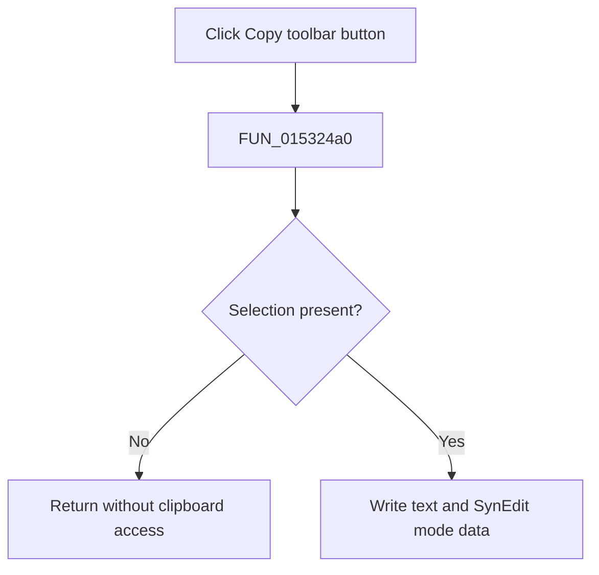

# Copy

> Analysis status: Complete. The shared handler and recovered SynEdit copy routine establish the selection guard and clipboard output.

## Control

| Property | Recovered value |
| --- | --- |
| Form | NetlistEditor |
| Component path | NetlistEditor.BtnPanel.CopyButton |
| Control class | TSpeedButton |
| Caption | Not present in the recovered resource. |
| Hint | Copy |
| Text | Not present in the recovered resource. |
| Handler name | MICopyClick |
| Handler address | 015324a0 |
| Graph node | `resource:dfm:NetlistEditor/NetlistEditor.BtnPanel.CopyButton` |
| Handler node | `function:015324a0` |
| Graph layer | UI |

## What happens when clicked

`FUN_015324a0` passes the Netlist Editor's SynEdit control at form offset `+0x958` to `FUN_00bf1d60`. That routine returns without clipboard access when the selection is empty. Otherwise, it extracts the selected text and writes standard text plus SynEdit selection-mode data to the clipboard.

The handler does not inspect `Sender`, so the toolbar control and `MICopy` use the same path. Copy does not change the editor text.

## Click flow

## Handler evidence

- Source: [DecompiledSources/Tina16/functions/00000000015324A0__FUN_015324a0.c](../../../DecompiledSources/Tina16/functions/00000000015324A0__FUN_015324a0.c)
- Recovered role: Copies the selected Netlist Editor text to the clipboard.
- Current graph summary: Handles 2 Delphi UI events: NetlistEditor.BtnPanel.CopyButton.OnClick, NetlistEditor.MainMenu.MEdit.MICopy.OnClick.
- Current graph behavior: Not present in the recovered resource.
- Current graph evidence: Not present in the recovered resource.
- Complexity: simple
- Distinct outgoing calls: 1

## Direct calls

- `function:00bf1d60` — FUN_00bf1d60

## Resource evidence

- Kind: Not present in the recovered resource.
- Modal result: Not present in the recovered resource.
- Checked state: Not present in the recovered resource.
- List items: Not present in the recovered resource.
- Image reference: Not present in the recovered resource.
- Extracted glyph: [`0281_NetlistEditor_NetlistEditor_BtnPanel_CopyButton_Glyph_Data.png`](../../../glyph/0281_NetlistEditor_NetlistEditor_BtnPanel_CopyButton_Glyph_Data.png)

## Nearby label candidates

Nearby labels are layout candidates only. They are not proof of behavior.

- No same-parent label candidate is available.

## Analysis limits

- The handler does not inspect `Sender`; the toolbar button and menu item use the same selection state.
- Clipboard allocation failures are handled inside the recovered SynEdit routine; this wrapper has no local message path.
