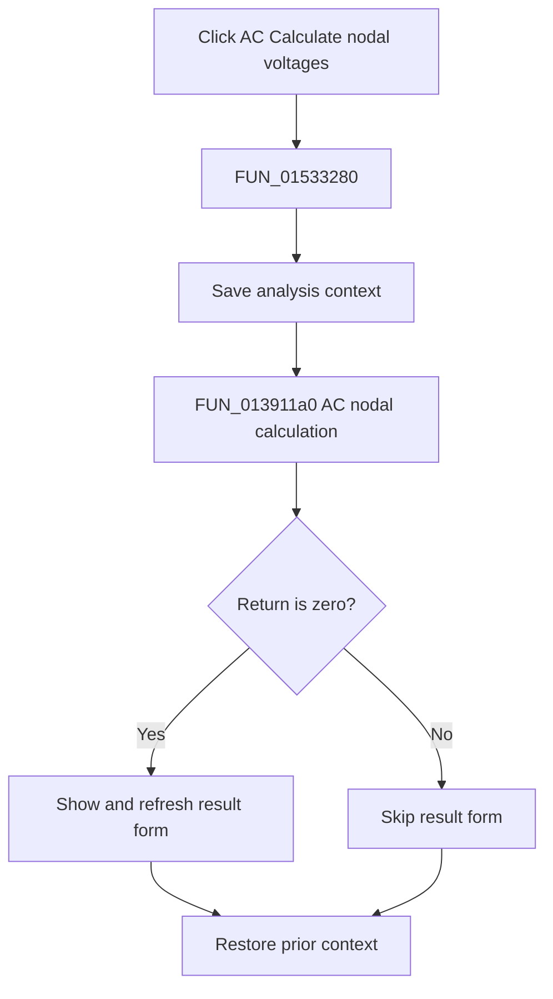

# &Calculate nodal voltages

> Analysis status: Complete. The analysis context, solver return branch, and result-window call establish the control flow.

## Control

| Property | Recovered value |
| --- | --- |
| Form | NetlistEditor |
| Component path | NetlistEditor.MainMenu.MAnalysis.MIACAnalysis.MIACCalculateNodalVoltages |
| Control class | TMenuItem |
| Caption | &Calculate nodal voltages |
| Hint | Not present in the recovered resource. |
| Text | Not present in the recovered resource. |
| Handler name | MIACCalculateNodalVoltagesClick |
| Handler address | 01533280 |
| Graph node | `resource:dfm:NetlistEditor/NetlistEditor.MainMenu.MAnalysis.MIACAnalysis.MIACCalculateNodalVoltages` |
| Handler node | `function:01533280` |
| Graph layer | UI |

## What happens when clicked

`FUN_01533280` saves the Netlist Editor analysis context with `FUN_0152fca0` in mode 0, then calls `FUN_013911a0` with the active circuit and the recovered AC nodal-voltage parameters. If that call returns zero, it calls `FUN_008059a0` for the global result form, which makes the form visible and refreshes it.

The handler always restores the prior context with `FUN_0152fd80`. A nonzero solver return skips the result-form call; its exact cause is not recovered here.

## Click flow

## Handler evidence

- Source: [DecompiledSources/Tina16/functions/0000000001533280__FUN_01533280.c](../../../DecompiledSources/Tina16/functions/0000000001533280__FUN_01533280.c)
- Recovered role: Runs the AC nodal-voltage calculation and shows the result on a zero solver return.
- Current graph summary: Handles 1 Delphi UI event: NetlistEditor.MainMenu.MAnalysis.MIACAnalysis.MIACCalculateNodalVoltages.OnClick.
- Current graph behavior: Not present in the recovered resource.
- Current graph evidence: Not present in the recovered resource.
- Complexity: complex
- Distinct outgoing calls: 4

## Direct calls

- `function:008059a0` — FUN_008059a0
- `function:013911a0` — FUN_013911a0
- `function:0152fca0` — FUN_0152fca0
- `function:0152fd80` — FUN_0152fd80

## Resource evidence

- Kind: Not present in the recovered resource.
- Modal result: Not present in the recovered resource.
- Checked state: Not present in the recovered resource.
- List items: Not present in the recovered resource.
- Image reference: Not present in the recovered resource.
- Extracted glyph: None.

## Nearby label candidates

Nearby labels are layout candidates only. They are not proof of behavior.

- No same-parent label candidate is available.

## Analysis limits

- The exact meanings of nonzero `FUN_013911a0` return values are not recovered.
- Result-form contents are produced inside the solver and result form, outside this wrapper.
