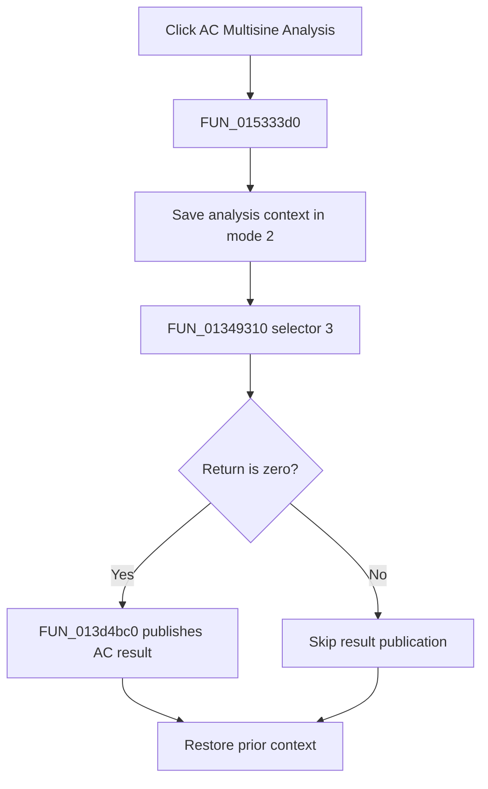

# AC Multisine Analysis...

> Analysis status: Complete. The recovered analysis call, zero-result branch, and AC result publisher establish the flow.

## Control

| Property | Recovered value |
| --- | --- |
| Form | NetlistEditor |
| Component path | NetlistEditor.MainMenu.MAnalysis.MIACAnalysis.MIACMultisineAnalysis |
| Control class | TMenuItem |
| Caption | AC Multisine Analysis... |
| Hint | Not present in the recovered resource. |
| Text | Not present in the recovered resource. |
| Handler name | MIACMultisineAnalysisClick |
| Handler address | 015333d0 |
| Graph node | `resource:dfm:NetlistEditor/NetlistEditor.MainMenu.MAnalysis.MIACAnalysis.MIACMultisineAnalysis` |
| Handler node | `function:015333d0` |
| Graph layer | UI |

## What happens when clicked

`FUN_015333d0` saves analysis context in mode 2 and calls `FUN_01349310` with analysis selector 3 and the active circuit. Only a zero return continues to `FUN_013d4bc0`, which creates and registers AC result data using the recovered multisine data field and global result-mode setting.

A nonzero return skips result publication. The handler always restores the prior context.

## Click flow

## Handler evidence

- Source: [DecompiledSources/Tina16/functions/00000000015333D0__FUN_015333d0.c](../../../DecompiledSources/Tina16/functions/00000000015333D0__FUN_015333d0.c)
- Recovered role: Runs AC multisine analysis and publishes its result when the setup call returns zero.
- Current graph summary: Handles 1 Delphi UI event: NetlistEditor.MainMenu.MAnalysis.MIACAnalysis.MIACMultisineAnalysis.OnClick.
- Current graph behavior: Not present in the recovered resource.
- Current graph evidence: Not present in the recovered resource.
- Complexity: complex
- Distinct outgoing calls: 4

## Direct calls

- `function:01349310` — FUN_01349310
- `function:013d4bc0` — FUN_013d4bc0
- `function:0152fca0` — FUN_0152fca0
- `function:0152fd80` — FUN_0152fd80

## Resource evidence

- Kind: Not present in the recovered resource.
- Modal result: Not present in the recovered resource.
- Checked state: Not present in the recovered resource.
- List items: Not present in the recovered resource.
- Image reference: Not present in the recovered resource.
- Extracted glyph: None.

## Nearby label candidates

Nearby labels are layout candidates only. They are not proof of behavior.

- No same-parent label candidate is available.

## Analysis limits

- The exact meanings of nonzero setup returns are not recovered.
- The global AC output-mode fields used by the publisher remain unnamed.
