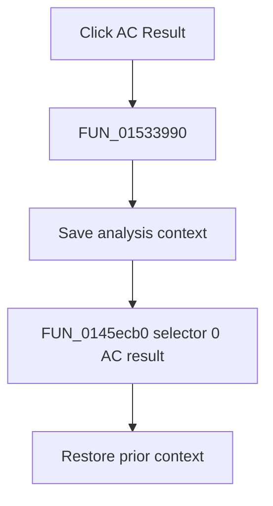

# AC Result

> Analysis status: Complete. The wrapper selector and recovered symbolic-result loop establish the numeric AC result path.

## Control

| Property | Recovered value |
| --- | --- |
| Form | NetlistEditor |
| Component path | NetlistEditor.MainMenu.MAnalysis.MISymbolic.MIACResult |
| Control class | TMenuItem |
| Caption | AC Result |
| Hint | Not present in the recovered resource. |
| Text | Not present in the recovered resource. |
| Handler name | MIACResultClick |
| Handler address | 01533990 |
| Graph node | `resource:dfm:NetlistEditor/NetlistEditor.MainMenu.MAnalysis.MISymbolic.MIACResult` |
| Handler node | `function:01533990` |
| Graph layer | UI |

## What happens when clicked

`FUN_01533990` saves analysis context and calls `FUN_0145ecb0` with selector 0 and the active circuit. The callee initializes the symbolic engine, labels the output `AC result:`, processes result entries until completion or cancellation, and, on completion, publishes the produced text in the result/equation window.

The handler restores the prior context after the callee returns.

## Click flow

## Handler evidence

- Source: [DecompiledSources/Tina16/functions/0000000001533990__FUN_01533990.c](../../../DecompiledSources/Tina16/functions/0000000001533990__FUN_01533990.c)
- Recovered role: Generates and displays the AC symbolic-result view with numeric formatting selector 0.
- Current graph summary: Handles 1 Delphi UI event: NetlistEditor.MainMenu.MAnalysis.MISymbolic.MIACResult.OnClick.
- Current graph behavior: Not present in the recovered resource.
- Current graph evidence: Not present in the recovered resource.
- Complexity: complex
- Distinct outgoing calls: 3

## Direct calls

- `function:0145ecb0` — FUN_0145ecb0
- `function:0152fca0` — FUN_0152fca0
- `function:0152fd80` — FUN_0152fd80

## Resource evidence

- Kind: Not present in the recovered resource.
- Modal result: Not present in the recovered resource.
- Checked state: Not present in the recovered resource.
- List items: Not present in the recovered resource.
- Image reference: Not present in the recovered resource.
- Extracted glyph: None.

## Nearby label candidates

Nearby labels are layout candidates only. They are not proof of behavior.

- No same-parent label candidate is available.

## Analysis limits

- The symbolic engine's internal expression transformations are not named.
- Cancellation is tested inside the callee; the wrapper has no separate message.
