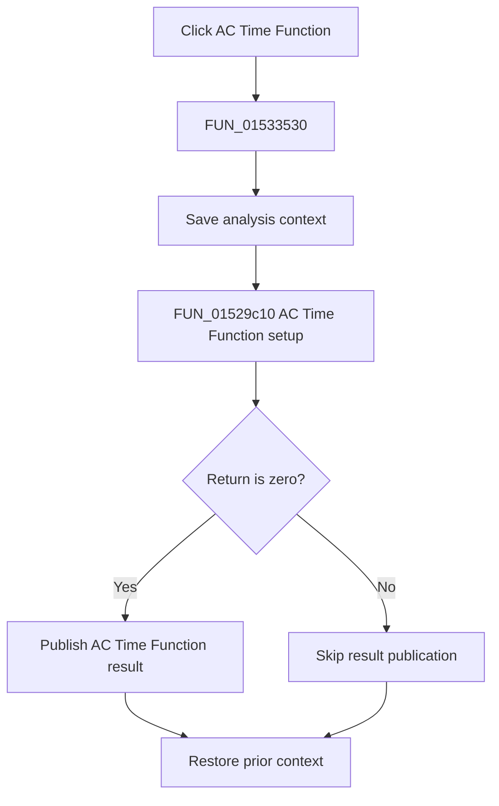

# &Time Function...

> Analysis status: Complete. The setup return branch and recovered AC Time Function result publisher establish the flow.

## Control

| Property | Recovered value |
| --- | --- |
| Form | NetlistEditor |
| Component path | NetlistEditor.MainMenu.MAnalysis.MIACAnalysis.MIACTimeFunction |
| Control class | TMenuItem |
| Caption | &Time Function... |
| Hint | Not present in the recovered resource. |
| Text | Not present in the recovered resource. |
| Handler name | MIACTimeFunctionClick |
| Handler address | 01533530 |
| Graph node | `resource:dfm:NetlistEditor/NetlistEditor.MainMenu.MAnalysis.MIACAnalysis.MIACTimeFunction` |
| Handler node | `function:01533530` |
| Graph layer | UI |

## What happens when clicked

`FUN_01533530` saves analysis context in mode 0, calls `FUN_01529c10`, and tests its return. A zero return calls `FUN_013d87d0`, which creates an `AC Time Function result` container, registers `Analysis Result 1`, publishes it, and refreshes the result UI.

A nonzero return skips publication. The handler always restores the prior analysis context.

## Click flow

## Handler evidence

- Source: [DecompiledSources/Tina16/functions/0000000001533530__FUN_01533530.c](../../../DecompiledSources/Tina16/functions/0000000001533530__FUN_01533530.c)
- Recovered role: Runs AC Time Function setup and publishes an AC Time Function result on success.
- Current graph summary: Handles 1 Delphi UI event: NetlistEditor.MainMenu.MAnalysis.MIACAnalysis.MIACTimeFunction.OnClick.
- Current graph behavior: Not present in the recovered resource.
- Current graph evidence: Not present in the recovered resource.
- Complexity: complex
- Distinct outgoing calls: 4

## Direct calls

- `function:013d87d0` — FUN_013d87d0
- `function:01529c10` — FUN_01529c10
- `function:0152fca0` — FUN_0152fca0
- `function:0152fd80` — FUN_0152fd80

## Resource evidence

- Kind: Not present in the recovered resource.
- Modal result: Not present in the recovered resource.
- Checked state: Not present in the recovered resource.
- List items: Not present in the recovered resource.
- Image reference: Not present in the recovered resource.
- Extracted glyph: None.

## Nearby label candidates

Nearby labels are layout candidates only. They are not proof of behavior.

- No same-parent label candidate is available.

## Analysis limits

- The exact meanings of nonzero setup returns are not recovered.
- The detailed waveform construction remains inside the setup and result routines.
