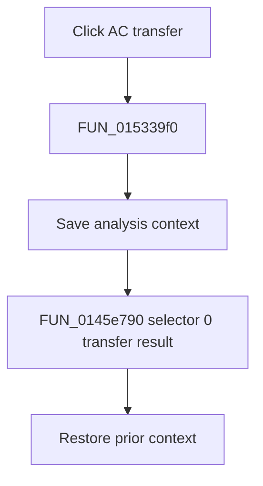

# AC transfer

> Analysis status: Complete. The wrapper selector and recovered symbolic transfer loop establish the numeric transfer path.

## Control

| Property | Recovered value |
| --- | --- |
| Form | NetlistEditor |
| Component path | NetlistEditor.MainMenu.MAnalysis.MISymbolic.MIACTransfer |
| Control class | TMenuItem |
| Caption | AC transfer |
| Hint | Not present in the recovered resource. |
| Text | Not present in the recovered resource. |
| Handler name | MIACTransferClick |
| Handler address | 015339f0 |
| Graph node | `resource:dfm:NetlistEditor/NetlistEditor.MainMenu.MAnalysis.MISymbolic.MIACTransfer` |
| Handler node | `function:015339f0` |
| Graph layer | UI |

## What happens when clicked

`FUN_015339f0` saves analysis context and calls `FUN_0145e790` with selector 0. The callee initializes the symbolic engine, chooses a recovered title such as `Transfer function:`, `Total resistance:`, or `Total impedance:`, normalizes produced expression text, and publishes it when processing completes without cancellation.

The handler restores the prior context after the callee returns.

## Click flow

## Handler evidence

- Source: [DecompiledSources/Tina16/functions/00000000015339F0__FUN_015339f0.c](../../../DecompiledSources/Tina16/functions/00000000015339F0__FUN_015339f0.c)
- Recovered role: Generates and displays the AC transfer or impedance expression with selector 0.
- Current graph summary: Handles 1 Delphi UI event: NetlistEditor.MainMenu.MAnalysis.MISymbolic.MIACTransfer.OnClick.
- Current graph behavior: Not present in the recovered resource.
- Current graph evidence: Not present in the recovered resource.
- Complexity: complex
- Distinct outgoing calls: 3

## Direct calls

- `function:0145e790` — FUN_0145e790
- `function:0152fca0` — FUN_0152fca0
- `function:0152fd80` — FUN_0152fd80

## Resource evidence

- Kind: Not present in the recovered resource.
- Modal result: Not present in the recovered resource.
- Checked state: Not present in the recovered resource.
- List items: Not present in the recovered resource.
- Image reference: Not present in the recovered resource.
- Extracted glyph: None.

## Nearby label candidates

Nearby labels are layout candidates only. They are not proof of behavior.

- No same-parent label candidate is available.

## Analysis limits

- The exact title branch depends on unnamed symbolic-engine state bytes.
- Cancellation and parser failures are handled inside the callee.
