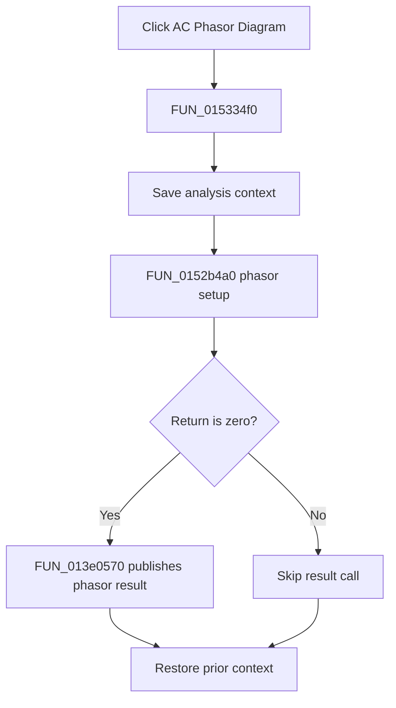

# &Phasor Diagram

> Analysis status: Complete. The setup return branch and phasor-result call establish the flow.

## Control

| Property | Recovered value |
| --- | --- |
| Form | NetlistEditor |
| Component path | NetlistEditor.MainMenu.MAnalysis.MIACAnalysis.MIACVectorDiagram |
| Control class | TMenuItem |
| Caption | &Phasor Diagram |
| Hint | Not present in the recovered resource. |
| Text | Not present in the recovered resource. |
| Handler name | MIACVectorDiagramClick |
| Handler address | 015334f0 |
| Graph node | `resource:dfm:NetlistEditor/NetlistEditor.MainMenu.MAnalysis.MIACAnalysis.MIACVectorDiagram` |
| Handler node | `function:015334f0` |
| Graph layer | UI |

## What happens when clicked

`FUN_015334f0` saves analysis context in mode 0 and calls `FUN_0152b4a0`. A zero return calls `FUN_013e0570` with the active result data. A nonzero return skips that result call.

The handler restores the prior analysis context on both branches.

## Click flow

## Handler evidence

- Source: [DecompiledSources/Tina16/functions/00000000015334F0__FUN_015334f0.c](../../../DecompiledSources/Tina16/functions/00000000015334F0__FUN_015334f0.c)
- Recovered role: Runs phasor-diagram setup and publishes the result when setup returns zero.
- Current graph summary: Handles 1 Delphi UI event: NetlistEditor.MainMenu.MAnalysis.MIACAnalysis.MIACVectorDiagram.OnClick.
- Current graph behavior: Not present in the recovered resource.
- Current graph evidence: Not present in the recovered resource.
- Complexity: complex
- Distinct outgoing calls: 4

## Direct calls

- `function:013e0570` — FUN_013e0570
- `function:0152b4a0` — FUN_0152b4a0
- `function:0152fca0` — FUN_0152fca0
- `function:0152fd80` — FUN_0152fd80

## Resource evidence

- Kind: Not present in the recovered resource.
- Modal result: Not present in the recovered resource.
- Checked state: Not present in the recovered resource.
- List items: Not present in the recovered resource.
- Image reference: Not present in the recovered resource.
- Extracted glyph: None.

## Nearby label candidates

Nearby labels are layout candidates only. They are not proof of behavior.

- No same-parent label candidate is available.

## Analysis limits

- The exact meanings of nonzero setup returns are not recovered.
- The internal phasor-series construction is outside this wrapper.
