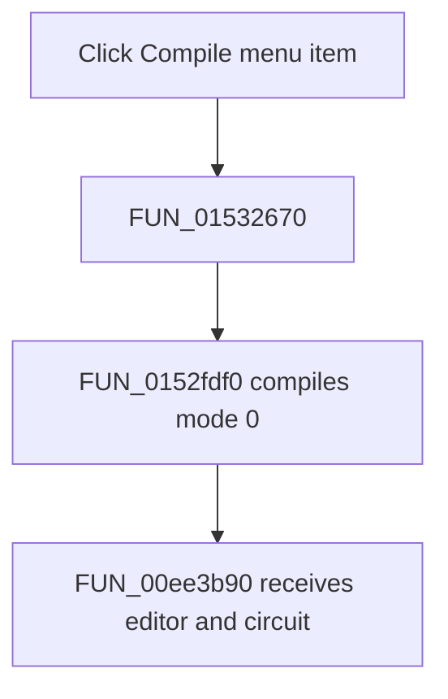

# &Compile

> Analysis status: Complete. The recovered shared handler and compiler call establish this control's path.

## Control

| Property | Recovered value |
| --- | --- |
| Form | NetlistEditor |
| Component path | NetlistEditor.MainMenu.MAnalysis.MICompile |
| Control class | TMenuItem |
| Caption | &Compile |
| Hint | Not present in the recovered resource. |
| Text | Not present in the recovered resource. |
| Handler name | MICompileClick |
| Handler address | 01532670 |
| Graph node | `resource:dfm:NetlistEditor/NetlistEditor.MainMenu.MAnalysis.MICompile` |
| Handler node | `function:01532670` |
| Graph layer | UI |

## What happens when clicked

`FUN_01532670` calls `FUN_0152fdf0` with compile mode 0. The callee captures the active form context, obtains the editor and circuit objects, and passes them to `FUN_00ee3b90` for compilation. It restores the prior context before it returns.

The handler does not inspect `Sender`, so the toolbar control and `MICompile` use the same path. The wrapper does not test a result or show a separate success message.

## Click flow

## Handler evidence

- Source: [DecompiledSources/Tina16/functions/0000000001532670__FUN_01532670.c](../../../DecompiledSources/Tina16/functions/0000000001532670__FUN_01532670.c)
- Recovered role: Compiles the current Netlist Editor document.
- Current graph summary: Handles 2 Delphi UI events: NetlistEditor.BtnPanel.CompileButton.OnClick, NetlistEditor.MainMenu.MAnalysis.MICompile.OnClick.
- Current graph behavior: Not present in the recovered resource.
- Current graph evidence: Not present in the recovered resource.
- Complexity: moderate
- Distinct outgoing calls: 2

## Direct calls

- `function:00414480` — Delphi UnicodeString clear and finalization helper
- `function:0152fdf0` — FUN_0152fdf0

## Resource evidence

- Kind: Not present in the recovered resource.
- Modal result: Not present in the recovered resource.
- Checked state: Not present in the recovered resource.
- List items: Not present in the recovered resource.
- Image reference: Not present in the recovered resource.
- Extracted glyph: None.

## Nearby label candidates

Nearby labels are layout candidates only. They are not proof of behavior.

- No same-parent label candidate is available.

## Analysis limits

- The handler does not inspect `Sender`; the toolbar button and menu item are behaviorally identical at this wrapper.
- The recovered compiler call does not expose the meaning of all diagnostic outputs in this handler.
