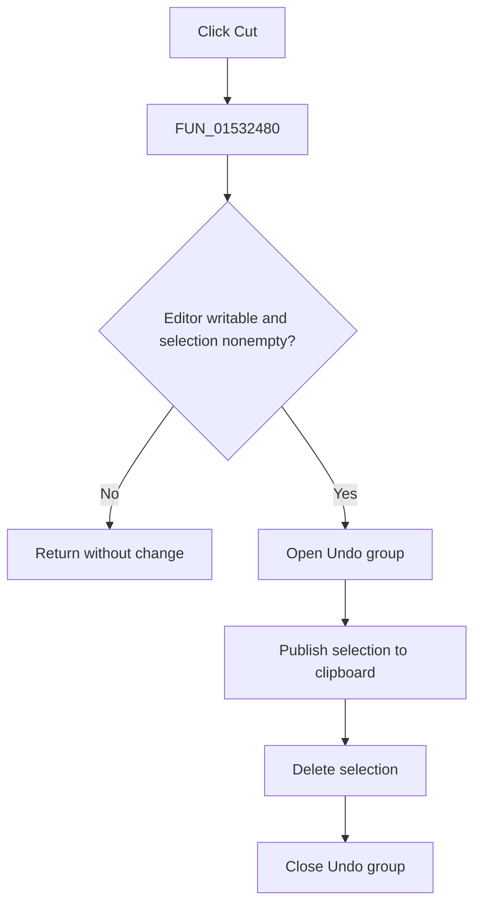

# Cu&t

> Analysis status: Complete. The recovered SynEdit routine establishes the read-only and empty-selection guards, clipboard output, deletion, and Undo group.

## Control

| Property | Recovered value |
| --- | --- |
| Form | NetlistEditor |
| Component path | NetlistEditor.MainMenu.MEdit.MICut |
| Control class | TMenuItem |
| Caption | Cu&t |
| Hint | Not present in the recovered resource. |
| Text | Not present in the recovered resource. |
| Handler name | MICutClick |
| Handler address | 01532480 |
| Graph node | `resource:dfm:NetlistEditor/NetlistEditor.MainMenu.MEdit.MICut` |
| Handler node | `function:01532480` |
| Graph layer | UI |

## What happens when clicked

`FUN_01532480` passes the editor at form offset `+0x958` to `FUN_00bf1e50`. That routine returns without change when the editor is read-only or the selection is empty.

Otherwise, it opens an Undo group, extracts and publishes the selected text in standard and SynEdit clipboard formats, replaces the selection with empty text, and closes the Undo group. Clipboard publication precedes deletion. The wrapper has no local confirmation or error message.

## Click flow

## Handler evidence

- Source: [DecompiledSources/Tina16/functions/0000000001532480__FUN_01532480.c](../../../DecompiledSources/Tina16/functions/0000000001532480__FUN_01532480.c)
- Recovered role: Cuts a writable, nonempty SynEdit selection to the clipboard as one Undo group.
- Current graph summary: Handles 1 Delphi UI event: NetlistEditor.MainMenu.MEdit.MICut.OnClick.
- Current graph behavior: Not present in the recovered resource.
- Current graph evidence: Not present in the recovered resource.
- Complexity: simple
- Distinct outgoing calls: 1

## Direct calls

- `function:00bf1e50` — FUN_00bf1e50

## Resource evidence

- Kind: Not present in the recovered resource.
- Modal result: Not present in the recovered resource.
- Checked state: Not present in the recovered resource.
- List items: Not present in the recovered resource.
- Image reference: Not present in the recovered resource.
- Extracted glyph: None.

## Nearby label candidates

Nearby labels are layout candidates only. They are not proof of behavior.

- No same-parent label candidate is available.

## Analysis limits

- The recovered routine can still delete after a clipboard allocation failure; this wrapper does not report that condition.
- Selection modes are handled inside SynEdit and are not changed by this handler.
