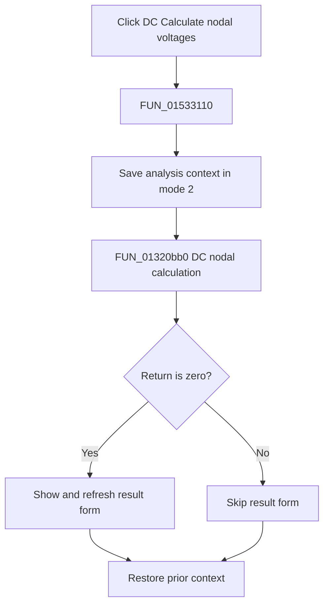

# &Calculate nodal voltages

> Analysis status: Complete. The analysis context, DC solver return branch, and result-form call establish the flow.

## Control

| Property | Recovered value |
| --- | --- |
| Form | NetlistEditor |
| Component path | NetlistEditor.MainMenu.MAnalysis.MIDCAnalysis.MIDCCalculateNodalVoltages |
| Control class | TMenuItem |
| Caption | &Calculate nodal voltages |
| Hint | Not present in the recovered resource. |
| Text | Not present in the recovered resource. |
| Handler name | MIDCCalculateNodalVoltagesClick |
| Handler address | 01533110 |
| Graph node | `resource:dfm:NetlistEditor/NetlistEditor.MainMenu.MAnalysis.MIDCAnalysis.MIDCCalculateNodalVoltages` |
| Handler node | `function:01533110` |
| Graph layer | UI |

## What happens when clicked

`FUN_01533110` saves analysis context in mode 2, then calls `FUN_01320bb0` with the active circuit and recovered DC nodal-voltage arguments. If the solver returns zero, the handler calls `FUN_008059a0` to show and refresh the global result form.

A nonzero return skips the result-form call. The prior context is restored on both branches.

## Click flow

## Handler evidence

- Source: [DecompiledSources/Tina16/functions/0000000001533110__FUN_01533110.c](../../../DecompiledSources/Tina16/functions/0000000001533110__FUN_01533110.c)
- Recovered role: Runs the DC nodal-voltage calculation and shows its result on a zero solver return.
- Current graph summary: Handles 1 Delphi UI event: NetlistEditor.MainMenu.MAnalysis.MIDCAnalysis.MIDCCalculateNodalVoltages.OnClick.
- Current graph behavior: Not present in the recovered resource.
- Current graph evidence: Not present in the recovered resource.
- Complexity: complex
- Distinct outgoing calls: 4

## Direct calls

- `function:008059a0` — FUN_008059a0
- `function:01320bb0` — FUN_01320bb0
- `function:0152fca0` — FUN_0152fca0
- `function:0152fd80` — FUN_0152fd80

## Resource evidence

- Kind: Not present in the recovered resource.
- Modal result: Not present in the recovered resource.
- Checked state: Not present in the recovered resource.
- List items: Not present in the recovered resource.
- Image reference: Not present in the recovered resource.
- Extracted glyph: None.

## Nearby label candidates

Nearby labels are layout candidates only. They are not proof of behavior.

- No same-parent label candidate is available.

## Analysis limits

- The exact meanings of nonzero solver returns are not recovered.
- The result table population occurs inside the solver and result form.
