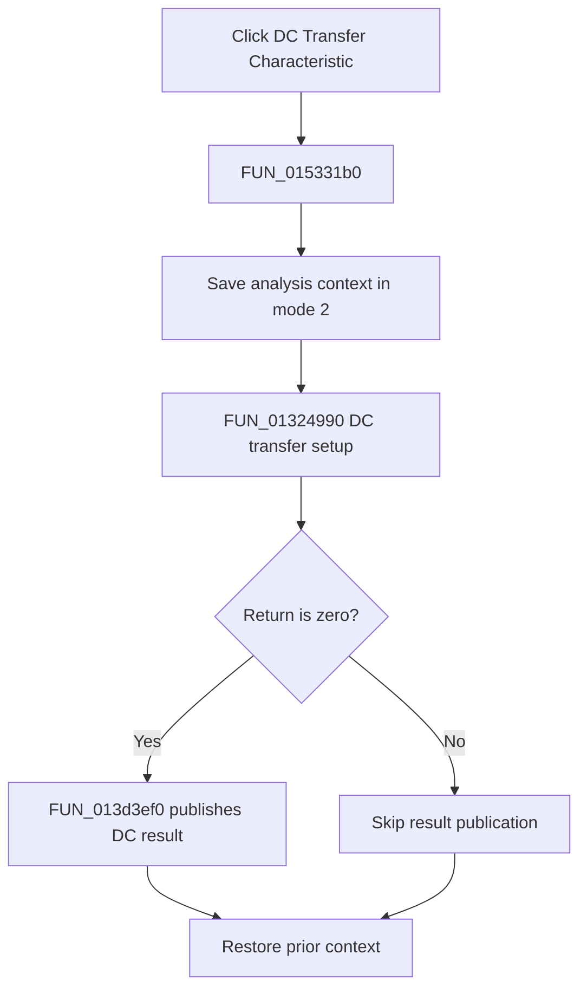

# &DC Transfer Characteristic...

> Analysis status: Complete. The setup return branch and recovered DC result publisher establish the flow.

## Control

| Property | Recovered value |
| --- | --- |
| Form | NetlistEditor |
| Component path | NetlistEditor.MainMenu.MAnalysis.MIDCAnalysis.MIDCTransferCharacteristic |
| Control class | TMenuItem |
| Caption | &DC Transfer Characteristic... |
| Hint | Not present in the recovered resource. |
| Text | Not present in the recovered resource. |
| Handler name | MIDCTransferCharacteristicClick |
| Handler address | 015331b0 |
| Graph node | `resource:dfm:NetlistEditor/NetlistEditor.MainMenu.MAnalysis.MIDCAnalysis.MIDCTransferCharacteristic` |
| Handler node | `function:015331b0` |
| Graph layer | UI |

## What happens when clicked

`FUN_015331b0` saves analysis context in mode 2 and calls `FUN_01324990`. A zero return passes the active result data to `FUN_013d3ef0`, which creates a numbered DC result container, registers `Analysis Result 1`, updates result state, and refreshes the application.

A nonzero setup return skips result publication. The handler restores the prior context on both branches.

## Click flow

## Handler evidence

- Source: [DecompiledSources/Tina16/functions/00000000015331B0__FUN_015331b0.c](../../../DecompiledSources/Tina16/functions/00000000015331B0__FUN_015331b0.c)
- Recovered role: Runs DC transfer setup and publishes a DC transfer result on success.
- Current graph summary: Handles 1 Delphi UI event: NetlistEditor.MainMenu.MAnalysis.MIDCAnalysis.MIDCTransferCharacteristic.OnClick.
- Current graph behavior: Not present in the recovered resource.
- Current graph evidence: Not present in the recovered resource.
- Complexity: complex
- Distinct outgoing calls: 4

## Direct calls

- `function:01324990` — FUN_01324990
- `function:013d3ef0` — FUN_013d3ef0
- `function:0152fca0` — FUN_0152fca0
- `function:0152fd80` — FUN_0152fd80

## Resource evidence

- Kind: Not present in the recovered resource.
- Modal result: Not present in the recovered resource.
- Checked state: Not present in the recovered resource.
- List items: Not present in the recovered resource.
- Image reference: Not present in the recovered resource.
- Extracted glyph: None.

## Nearby label candidates

Nearby labels are layout candidates only. They are not proof of behavior.

- No same-parent label candidate is available.

## Analysis limits

- The exact meanings of nonzero setup returns are not recovered.
- The DC sweep input configuration remains inside `FUN_01324990`.
