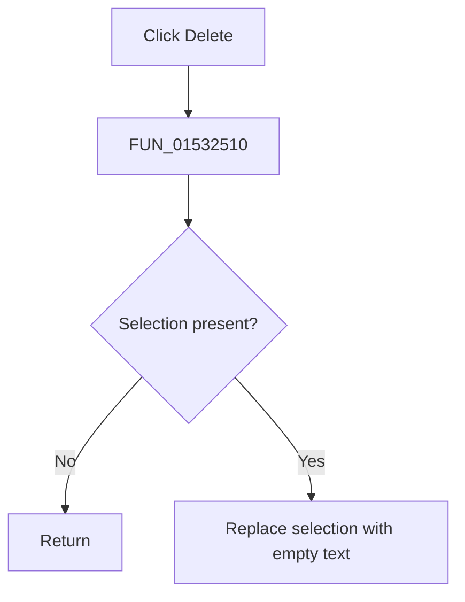

# &Delete

> Analysis status: Complete. The recovered selection test and replacement call establish the no-op and deletion paths.

## Control

| Property | Recovered value |
| --- | --- |
| Form | NetlistEditor |
| Component path | NetlistEditor.MainMenu.MEdit.MIDelete |
| Control class | TMenuItem |
| Caption | &Delete |
| Hint | Not present in the recovered resource. |
| Text | Not present in the recovered resource. |
| Handler name | MIDeleteClick |
| Handler address | 01532510 |
| Graph node | `resource:dfm:NetlistEditor/NetlistEditor.MainMenu.MEdit.MIDelete` |
| Handler node | `function:01532510` |
| Graph layer | UI |

## What happens when clicked

`FUN_01532510` passes the editor to `FUN_00c08110`. That routine tests whether a selection exists with `FUN_00bf2c80`. An empty selection is a no-op; a nonempty selection is replaced with empty text through `FUN_00c08be0`.

Undo and modified-state effects are handled inside the SynEdit replacement routine. The handler has no confirmation prompt.

## Click flow

## Handler evidence

- Source: [DecompiledSources/Tina16/functions/0000000001532510__FUN_01532510.c](../../../DecompiledSources/Tina16/functions/0000000001532510__FUN_01532510.c)
- Recovered role: Deletes the current SynEdit selection without using the clipboard.
- Current graph summary: Handles 1 Delphi UI event: NetlistEditor.MainMenu.MEdit.MIDelete.OnClick.
- Current graph behavior: Not present in the recovered resource.
- Current graph evidence: Not present in the recovered resource.
- Complexity: simple
- Distinct outgoing calls: 1

## Direct calls

- `function:00c08110` — FUN_00c08110

## Resource evidence

- Kind: Not present in the recovered resource.
- Modal result: Not present in the recovered resource.
- Checked state: Not present in the recovered resource.
- List items: Not present in the recovered resource.
- Image reference: Not present in the recovered resource.
- Extracted glyph: None.

## Nearby label candidates

Nearby labels are layout candidates only. They are not proof of behavior.

- No same-parent label candidate is available.

## Analysis limits

- The wrapper does not expose the selection mode or resulting caret position.
- Any read-only guard is handled below this recovered wrapper.
