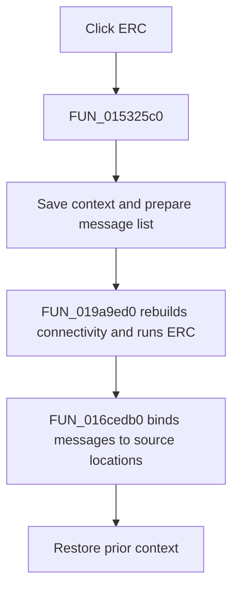

# ERC

> Analysis status: Complete. The recovered wrapper, ERC engine annotation, and message-location binding establish the full action.

## Control

| Property | Recovered value |
| --- | --- |
| Form | NetlistEditor |
| Component path | NetlistEditor.MainMenu.MAnalysis.MIERC |
| Control class | TMenuItem |
| Caption | ERC |
| Hint | Not present in the recovered resource. |
| Text | Not present in the recovered resource. |
| Handler name | MIERCClick |
| Handler address | 015325c0 |
| Graph node | `resource:dfm:NetlistEditor/NetlistEditor.MainMenu.MAnalysis.MIERC` |
| Handler node | `function:015325c0` |
| Graph layer | UI |

## What happens when clicked

`FUN_015325c0` saves the analysis context, clears and prepares the message-list state, and calls `FUN_019a9ed0` with the active schematic plus the recovered ERC rule matrix and option globals. That engine rebuilds derived connectivity, checks node and pin conditions, appends findings and a final count summary, and attaches schematic-location collections.

The handler then calls `FUN_016cedb0` to bind the result messages to the Netlist Editor's location state and restores the prior context. The recovered path has no cancellation transaction or persistence write.

## Click flow

## Handler evidence

- Source: [DecompiledSources/Tina16/functions/00000000015325C0__FUN_015325c0.c](../../../DecompiledSources/Tina16/functions/00000000015325C0__FUN_015325c0.c)
- Recovered role: Runs electrical-rules checks and binds findings to the Netlist Editor message list.
- Current graph summary: Handles 1 Delphi UI event: NetlistEditor.MainMenu.MAnalysis.MIERC.OnClick.
- Current graph behavior: Not present in the recovered resource.
- Current graph evidence: Not present in the recovered resource.
- Complexity: complex
- Distinct outgoing calls: 4

## Direct calls

- `function:0152fca0` — FUN_0152fca0
- `function:0152fd80` — FUN_0152fd80
- `function:016cedb0` — FUN_016cedb0
- `function:019a9ed0` — FUN_019a9ed0

## Resource evidence

- Kind: Not present in the recovered resource.
- Modal result: Not present in the recovered resource.
- Checked state: Not present in the recovered resource.
- List items: Not present in the recovered resource.
- Image reference: Not present in the recovered resource.
- Extracted glyph: None.

## Nearby label candidates

Nearby labels are layout candidates only. They are not proof of behavior.

- No same-parent label candidate is available.

## Analysis limits

- The exact Delphi names of the ERC option globals are not recovered.
- The result list is updated in memory; this path does not prove that findings are persisted.
