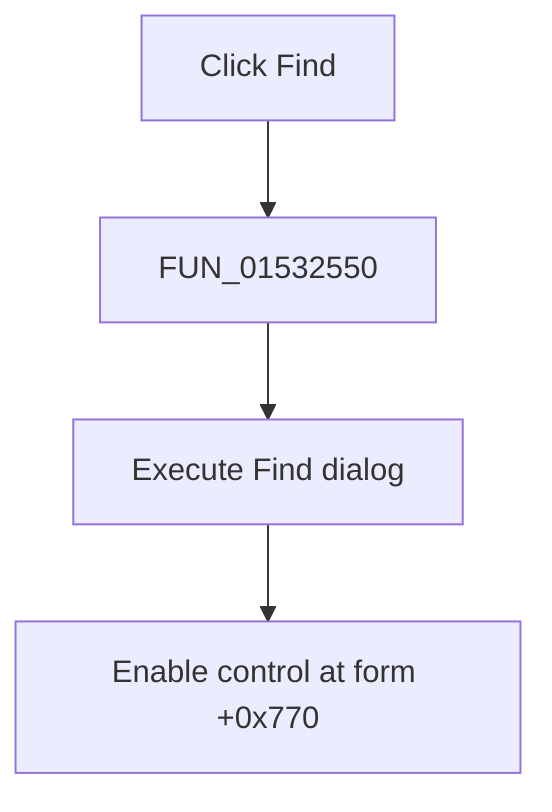

# &Find...

> Analysis status: Complete. The dialog execution and post-dialog state update establish the action.

## Control

| Property | Recovered value |
| --- | --- |
| Form | NetlistEditor |
| Component path | NetlistEditor.MainMenu.MEdit.MIFind |
| Control class | TMenuItem |
| Caption | &Find... |
| Hint | Not present in the recovered resource. |
| Text | Not present in the recovered resource. |
| Handler name | MIFindClick |
| Handler address | 01532550 |
| Graph node | `resource:dfm:NetlistEditor/NetlistEditor.MainMenu.MEdit.MIFind` |
| Handler node | `function:01532550` |
| Graph layer | UI |

## What happens when clicked

`FUN_01532550` executes the dialog object at form offset `+0x8b8` through its virtual method at `+0xa8`, which is the recovered modal/dialog execution pattern. After the dialog returns, the handler calls `FUN_007e2da0` with true for the object at form offset `+0x770`.

`FUN_007e2da0` updates the enabled-state byte and publishes the change to the control. The exact identity of the `+0x770` object is not recovered in the handler.

## Click flow

## Handler evidence

- Source: [DecompiledSources/Tina16/functions/0000000001532550__FUN_01532550.c](../../../DecompiledSources/Tina16/functions/0000000001532550__FUN_01532550.c)
- Recovered role: Opens the Find dialog and enables a related recovered control after it closes.
- Current graph summary: Handles 1 Delphi UI event: NetlistEditor.MainMenu.MEdit.MIFind.OnClick.
- Current graph behavior: Not present in the recovered resource.
- Current graph evidence: Not present in the recovered resource.
- Complexity: simple
- Distinct outgoing calls: 1

## Direct calls

- `function:007e2da0` — FUN_007e2da0

## Resource evidence

- Kind: Not present in the recovered resource.
- Modal result: Not present in the recovered resource.
- Checked state: Not present in the recovered resource.
- List items: Not present in the recovered resource.
- Image reference: Not present in the recovered resource.
- Extracted glyph: None.

## Nearby label candidates

Nearby labels are layout candidates only. They are not proof of behavior.

- No same-parent label candidate is available.

## Analysis limits

- The dialog result is not tested by this wrapper.
- The Delphi component name for form field `+0x770` is not recovered.
