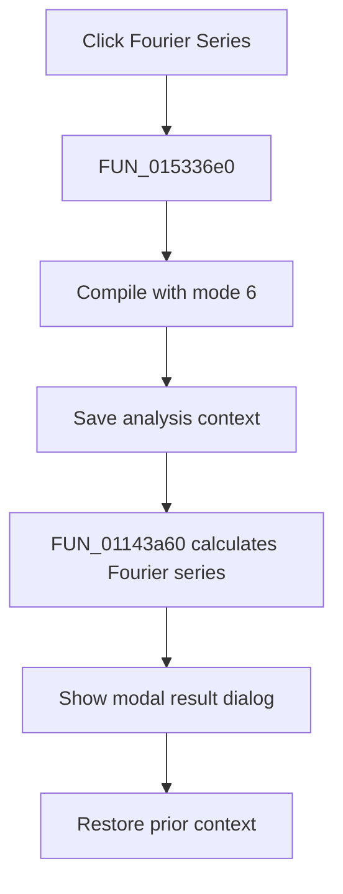

# Fourier Series...

> Analysis status: Complete. The compile call, analysis context, Fourier routine, and result dialog establish the flow.

## Control

| Property | Recovered value |
| --- | --- |
| Form | NetlistEditor |
| Component path | NetlistEditor.MainMenu.MAnalysis.MIFourier.MIFourierSeries |
| Control class | TMenuItem |
| Caption | Fourier Series... |
| Hint | Not present in the recovered resource. |
| Text | Not present in the recovered resource. |
| Handler name | MIFourierSeriesClick |
| Handler address | 015336e0 |
| Graph node | `resource:dfm:NetlistEditor/NetlistEditor.MainMenu.MAnalysis.MIFourier.MIFourierSeries` |
| Handler node | `function:015336e0` |
| Graph layer | UI |

## What happens when clicked

`FUN_015336e0` first calls `FUN_0152fdf0` with compile mode 6. It then saves the analysis context and calls `FUN_01143a60` with the active circuit. That routine selects a recovered time interval from the global Fourier settings, runs `FUN_0113f440`, prepares series data, creates a Fourier result dialog, executes it modally, and destroys it.

The handler restores the prior context after the Fourier routine returns. It does not test a separate compile or dialog result.

## Click flow

## Handler evidence

- Source: [DecompiledSources/Tina16/functions/00000000015336E0__FUN_015336e0.c](../../../DecompiledSources/Tina16/functions/00000000015336E0__FUN_015336e0.c)
- Recovered role: Compiles the document, calculates a Fourier series, and opens its result dialog.
- Current graph summary: Handles 1 Delphi UI event: NetlistEditor.MainMenu.MAnalysis.MIFourier.MIFourierSeries.OnClick.
- Current graph behavior: Not present in the recovered resource.
- Current graph evidence: Not present in the recovered resource.
- Complexity: complex
- Distinct outgoing calls: 4

## Direct calls

- `function:01143a60` — FUN_01143a60
- `function:0152fca0` — FUN_0152fca0
- `function:0152fd80` — FUN_0152fd80
- `function:0152fdf0` — FUN_0152fdf0

## Resource evidence

- Kind: Not present in the recovered resource.
- Modal result: Not present in the recovered resource.
- Checked state: Not present in the recovered resource.
- List items: Not present in the recovered resource.
- Image reference: Not present in the recovered resource.
- Extracted glyph: None.

## Nearby label candidates

Nearby labels are layout candidates only. They are not proof of behavior.

- No same-parent label candidate is available.

## Analysis limits

- The recovered global Fourier time and frequency fields have no Delphi names.
- The wrapper does not expose a separate compile-success test.
