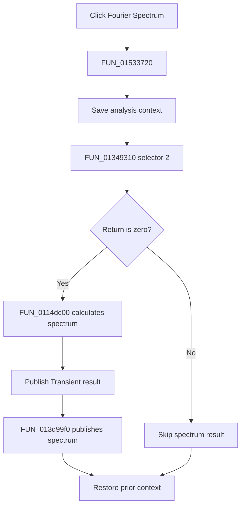

# Fourier Spectrum...

> Analysis status: Complete. The setup return branch, spectrum calculation, and result publication calls establish the flow.

## Control

| Property | Recovered value |
| --- | --- |
| Form | NetlistEditor |
| Component path | NetlistEditor.MainMenu.MAnalysis.MIFourier.MIFourierSpectrum |
| Control class | TMenuItem |
| Caption | Fourier Spectrum... |
| Hint | Not present in the recovered resource. |
| Text | Not present in the recovered resource. |
| Handler name | MIFourierSpectrumClick |
| Handler address | 01533720 |
| Graph node | `resource:dfm:NetlistEditor/NetlistEditor.MainMenu.MAnalysis.MIFourier.MIFourierSpectrum` |
| Handler node | `function:01533720` |
| Graph layer | UI |

## What happens when clicked

`FUN_01533720` saves analysis context, then calls `FUN_01349310` with analysis selector 2. A nonzero return skips all result work. On zero, `FUN_0114dc00` calculates spectrum data from recovered global window and range settings.

The success branch publishes a Transient result through `FUN_013d2f60`, then calls `FUN_013d99f0` with the spectrum object and recovered display flags. The handler restores the prior context after either branch.

## Click flow

## Handler evidence

- Source: [DecompiledSources/Tina16/functions/0000000001533720__FUN_01533720.c](../../../DecompiledSources/Tina16/functions/0000000001533720__FUN_01533720.c)
- Recovered role: Runs Fourier-spectrum setup, calculates a spectrum, and publishes its results on success.
- Current graph summary: Handles 1 Delphi UI event: NetlistEditor.MainMenu.MAnalysis.MIFourier.MIFourierSpectrum.OnClick.
- Current graph behavior: Not present in the recovered resource.
- Current graph evidence: Not present in the recovered resource.
- Complexity: complex
- Distinct outgoing calls: 6

## Direct calls

- `function:0114dc00` — FUN_0114dc00
- `function:01349310` — FUN_01349310
- `function:013d2f60` — FUN_013d2f60
- `function:013d99f0` — FUN_013d99f0
- `function:0152fca0` — FUN_0152fca0
- `function:0152fd80` — FUN_0152fd80

## Resource evidence

- Kind: Not present in the recovered resource.
- Modal result: Not present in the recovered resource.
- Checked state: Not present in the recovered resource.
- List items: Not present in the recovered resource.
- Image reference: Not present in the recovered resource.
- Extracted glyph: None.

## Nearby label candidates

Nearby labels are layout candidates only. They are not proof of behavior.

- No same-parent label candidate is available.

## Analysis limits

- The exact meanings of nonzero setup returns are not recovered.
- The recovered spectrum window and display option globals have no Delphi names.
