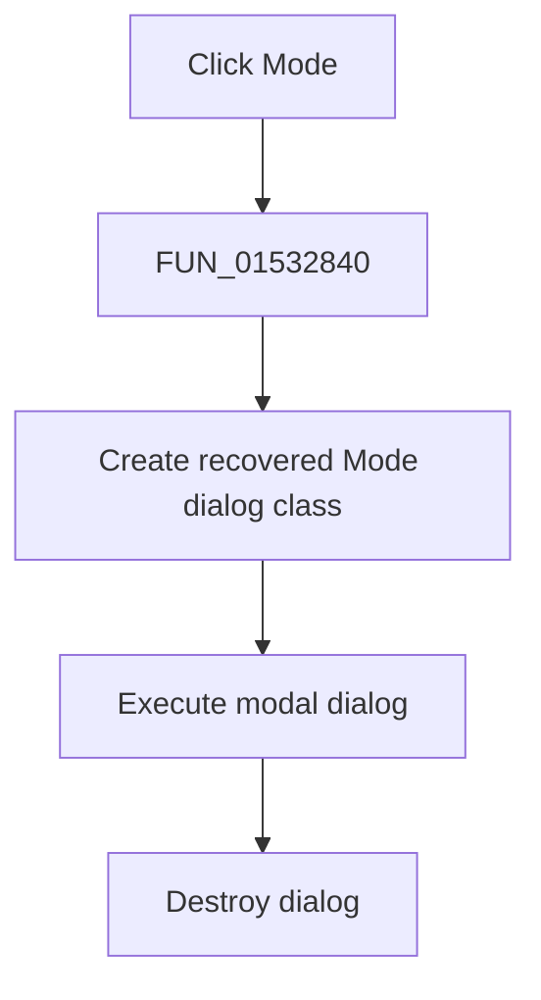

# &Mode...

> Analysis status: Complete. The recovered dialog construction, modal execution, and destruction establish the action.

## Control

| Property | Recovered value |
| --- | --- |
| Form | NetlistEditor |
| Component path | NetlistEditor.MainMenu.MAnalysis.MIMode |
| Control class | TMenuItem |
| Caption | &Mode... |
| Hint | Not present in the recovered resource. |
| Text | Not present in the recovered resource. |
| Handler name | MIModeClick |
| Handler address | 01532840 |
| Graph node | `resource:dfm:NetlistEditor/NetlistEditor.MainMenu.MAnalysis.MIMode` |
| Handler node | `function:01532840` |
| Graph layer | UI |

## What happens when clicked

`FUN_01532840` creates a form of the recovered class referenced by `PTR_FUN_01154178`, executes its modal method at VMT offset `+0x2d0`, and then destroys the object with the nil-safe Delphi destructor helper.

The handler ignores the modal result. Any setting changes are handled within the dialog object; no direct form-state copy is present in this wrapper.

## Click flow

## Handler evidence

- Source: [DecompiledSources/Tina16/functions/0000000001532840__FUN_01532840.c](../../../DecompiledSources/Tina16/functions/0000000001532840__FUN_01532840.c)
- Recovered role: Opens the Mode dialog and releases it after it closes.
- Current graph summary: Handles 1 Delphi UI event: NetlistEditor.MainMenu.MAnalysis.MIMode.OnClick.
- Current graph behavior: Not present in the recovered resource.
- Current graph evidence: Not present in the recovered resource.
- Complexity: moderate
- Distinct outgoing calls: 2

## Direct calls

- `function:00410f20` — Nil-safe Delphi object destruction helper
- `function:007fc180` — FUN_007fc180

## Resource evidence

- Kind: Not present in the recovered resource.
- Modal result: Not present in the recovered resource.
- Checked state: Not present in the recovered resource.
- List items: Not present in the recovered resource.
- Image reference: Not present in the recovered resource.
- Extracted glyph: None.

## Nearby label candidates

Nearby labels are layout candidates only. They are not proof of behavior.

- No same-parent label candidate is available.

## Analysis limits

- The dialog's Delphi class name is not recovered.
- The wrapper does not reveal which settings the dialog commits internally.
