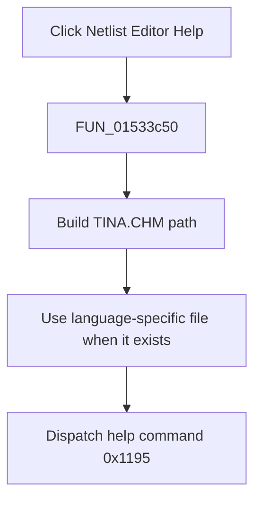

# &Netlist Editor

> Analysis status: Complete. The recovered help-path construction, localized-file selection, and application help command establish the action.

## Control

| Property | Recovered value |
| --- | --- |
| Form | NetlistEditor |
| Component path | NetlistEditor.MainMenu.MHelp.MINetlistEditor |
| Control class | TMenuItem |
| Caption | &Netlist Editor |
| Hint | Not present in the recovered resource. |
| Text | Not present in the recovered resource. |
| Handler name | MINetlistEditorClick |
| Handler address | 01533c50 |
| Graph node | `resource:dfm:NetlistEditor/NetlistEditor.MainMenu.MHelp.MINetlistEditor` |
| Handler node | `function:01533c50` |
| Graph layer | UI |

## What happens when clicked

`FUN_01533c50` builds a path ending in `TINA.CHM` from the recovered application help directory. It passes that path to `FUN_01b1def0`, which selects an existing language-specific file variant or falls back to the original path.

The handler dispatches application help command `0x1195` with the selected path through the global application's help object. The wrapper does not test a success result or show a local error.

## Click flow

## Handler evidence

- Source: [DecompiledSources/Tina16/functions/0000000001533C50__FUN_01533c50.c](../../../DecompiledSources/Tina16/functions/0000000001533C50__FUN_01533c50.c)
- Recovered role: Opens the Netlist Editor help topic from TINA.CHM.
- Current graph summary: Handles 1 Delphi UI event: NetlistEditor.MainMenu.MHelp.MINetlistEditor.OnClick.
- Current graph behavior: Not present in the recovered resource.
- Current graph evidence: Not present in the recovered resource.
- Complexity: complex
- Distinct outgoing calls: 3

## Direct calls

- `function:00414560` — Delphi UnicodeString array finalization helper
- `function:00416cd0` — FUN_00416cd0
- `function:01b1def0` — FUN_01b1def0

## Resource evidence

- Kind: Not present in the recovered resource.
- Modal result: Not present in the recovered resource.
- Checked state: Not present in the recovered resource.
- List items: Not present in the recovered resource.
- Image reference: Not present in the recovered resource.
- Extracted glyph: None.

## Nearby label candidates

Nearby labels are layout candidates only. They are not proof of behavior.

- No same-parent label candidate is available.

## Analysis limits

- The numeric help command's symbolic constant is not recovered.
- Missing-file or viewer errors are handled by the application help subsystem.
