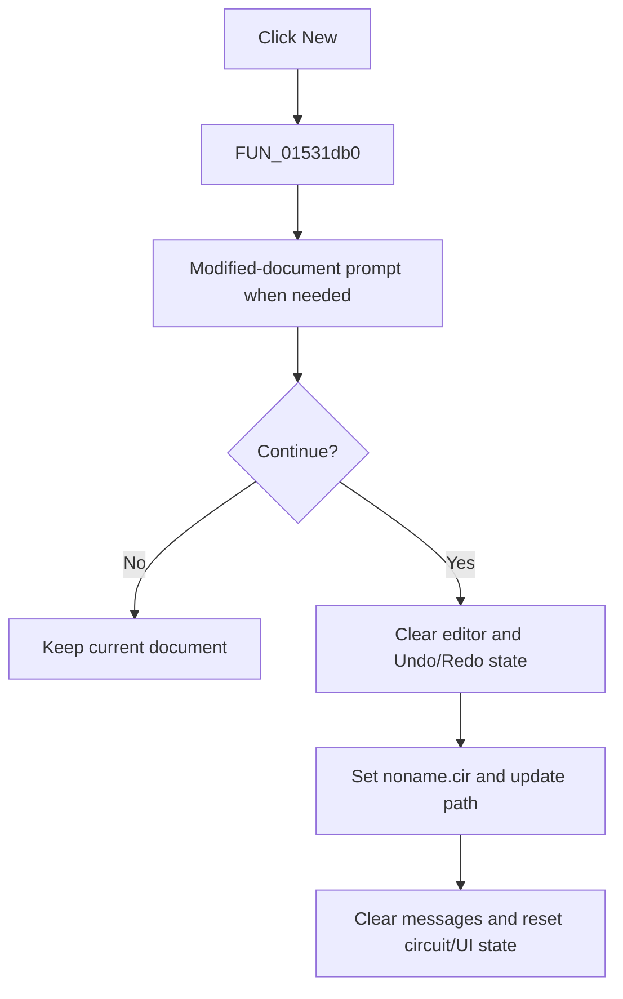

# &New

> Analysis status: Complete. The modified-document gate and recovered editor, file, message, circuit, and UI resets establish the action.

## Control

| Property | Recovered value |
| --- | --- |
| Form | NetlistEditor |
| Component path | NetlistEditor.MainMenu.MFile.MINew |
| Control class | TMenuItem |
| Caption | &New |
| Hint | Not present in the recovered resource. |
| Text | Not present in the recovered resource. |
| Handler name | MINewClick |
| Handler address | 01531db0 |
| Graph node | `resource:dfm:NetlistEditor/NetlistEditor.MainMenu.MFile.MINew` |
| Handler node | `function:01531db0` |
| Graph layer | UI |

## What happens when clicked

`FUN_01531db0` first calls `FUN_0152fa50`. If the editor is modified, that helper asks whether to save, cancel, or continue. Cancel returns without resetting the document; the save choice calls the Save handler without checking its result.

When allowed, the handler clears the SynEdit lines and Undo/Redo state, clears the modified flag, sets form state byte `+0x1c49`, assigns `noname.cir`, updates the displayed path, clears the message list and circuit state, resets recovered global option bytes from form fields, copies the global settings record to the form record, and focuses the message/editor control. The handler has no separate success message.

## Click flow

## Handler evidence

- Source: [DecompiledSources/Tina16/functions/0000000001531DB0__FUN_01531db0.c](../../../DecompiledSources/Tina16/functions/0000000001531DB0__FUN_01531db0.c)
- Recovered role: Creates a blank `noname.cir` document after the modified-document gate allows it.
- Current graph summary: Handles 1 Delphi UI event: NetlistEditor.MainMenu.MFile.MINew.OnClick.
- Current graph behavior: Not present in the recovered resource.
- Current graph evidence: Not present in the recovered resource.
- Complexity: complex
- Distinct outgoing calls: 11

## Direct calls

- `function:00414480` — Delphi UnicodeString clear and finalization helper
- `function:00414ad0` — Delphi UnicodeString assignment helper
- `function:00417c40` — FUN_00417c40
- `function:00441920` — FUN_00441920
- `function:00442f70` — FUN_00442f70
- `function:0064de00` — VCL control text setter with change suppression
- `function:00c0dad0` — FUN_00c0dad0
- `function:00c0fae0` — FUN_00c0fae0
- `function:0152fa50` — FUN_0152fa50
- `function:019953b0` — FUN_019953b0
- `function:01d0e500` — FUN_01d0e500

## Resource evidence

- Kind: Not present in the recovered resource.
- Modal result: Not present in the recovered resource.
- Checked state: Not present in the recovered resource.
- List items: Not present in the recovered resource.
- Image reference: Not present in the recovered resource.
- Extracted glyph: None.

## Nearby label candidates

Nearby labels are layout candidates only. They are not proof of behavior.

- No same-parent label candidate is available.

## Analysis limits

- The save choice in the modified-document prompt is called without a checked return value.
- Several reset fields and the final focused control have no recovered Delphi names.
