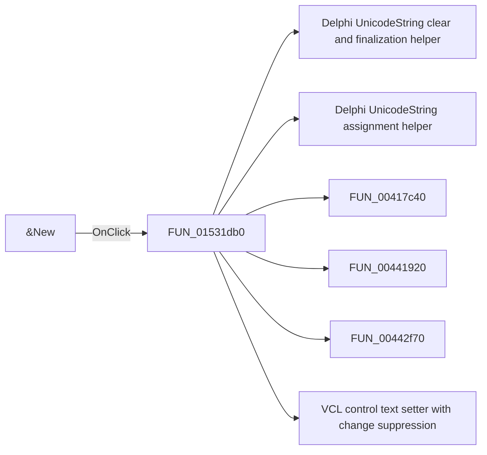

# &New

> Analysis status: Pending individual source review.

## Control

| Property | Recovered value |
| --- | --- |
| Form | NetlistEditor |
| Component path | NetlistEditor.MainMenu.MFile.MINew |
| Control class | TMenuItem |
| Caption | &New |
| Hint | Not present in the recovered resource. |
| Text | Not present in the recovered resource. |
| Handler name | MINewClick |
| Handler address | 01531db0 |
| Graph node | `resource:dfm:NetlistEditor/NetlistEditor.MainMenu.MFile.MINew` |
| Handler node | `function:01531db0` |
| Graph layer | UI |

## What happens when clicked

Pending individual analysis. An agent must read the recovered handler source and its relevant callees before it replaces this text.

## Click flow

## Handler evidence

- Source: [DecompiledSources/Tina16/functions/0000000001531DB0__FUN_01531db0.c](../../../DecompiledSources/Tina16/functions/0000000001531DB0__FUN_01531db0.c)
- Recovered role: Not present in the recovered resource.
- Current graph summary: Handles 1 Delphi UI event: NetlistEditor.MainMenu.MFile.MINew.OnClick.
- Current graph behavior: Not present in the recovered resource.
- Current graph evidence: Not present in the recovered resource.
- Complexity: complex
- Distinct outgoing calls: 11

## Direct calls

- `function:00414480` — Delphi UnicodeString clear and finalization helper
- `function:00414ad0` — Delphi UnicodeString assignment helper
- `function:00417c40` — FUN_00417c40
- `function:00441920` — FUN_00441920
- `function:00442f70` — FUN_00442f70
- `function:0064de00` — VCL control text setter with change suppression
- `function:00c0dad0` — FUN_00c0dad0
- `function:00c0fae0` — FUN_00c0fae0
- `function:0152fa50` — FUN_0152fa50
- `function:019953b0` — FUN_019953b0
- `function:01d0e500` — FUN_01d0e500

## Resource evidence

- Kind: Not present in the recovered resource.
- Modal result: Not present in the recovered resource.
- Checked state: Not present in the recovered resource.
- List items: Not present in the recovered resource.
- Image reference: Not present in the recovered resource.
- Extracted glyph: None.

## Nearby label candidates

Nearby labels are layout candidates only. They are not proof of behavior.

- No same-parent label candidate is available.

## Analysis limits

- Do not infer behavior from the control class, caption, hint, glyph, or nearby label alone.
- Do not replace the pending status until the handler source and relevant call path provide enough evidence.
