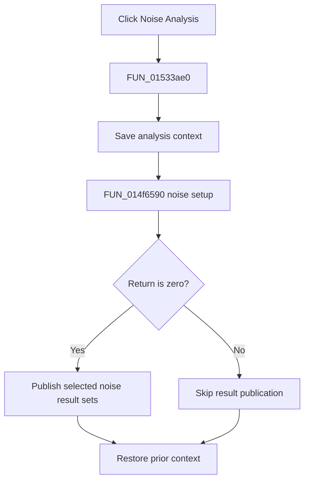

# &Noise Analysis...

> Analysis status: Complete. The setup return branch and recovered noise result publisher establish the flow.

## Control

| Property | Recovered value |
| --- | --- |
| Form | NetlistEditor |
| Component path | NetlistEditor.MainMenu.MAnalysis.MINoiseAnalysis |
| Control class | TMenuItem |
| Caption | &Noise Analysis... |
| Hint | Not present in the recovered resource. |
| Text | Not present in the recovered resource. |
| Handler name | MINoiseAnalysisClick |
| Handler address | 01533ae0 |
| Graph node | `resource:dfm:NetlistEditor/NetlistEditor.MainMenu.MAnalysis.MINoiseAnalysis` |
| Handler node | `function:01533ae0` |
| Graph layer | UI |

## What happens when clicked

`FUN_01533ae0` saves analysis context and calls `FUN_014f6590` with the active circuit. A zero return passes the produced data and recovered global result-mask byte to `FUN_013d8d70`. That publisher can create `Output noise`, `Input noise`, `Total noise`, and `Signal to Noise` result sets according to mask bits, then refreshes the result UI.

A nonzero setup return skips publication. The handler restores the prior context on both branches.

## Click flow

## Handler evidence

- Source: [DecompiledSources/Tina16/functions/0000000001533AE0__FUN_01533ae0.c](../../../DecompiledSources/Tina16/functions/0000000001533AE0__FUN_01533ae0.c)
- Recovered role: Runs noise-analysis setup and publishes selected noise results on success.
- Current graph summary: Handles 1 Delphi UI event: NetlistEditor.MainMenu.MAnalysis.MINoiseAnalysis.OnClick.
- Current graph behavior: Not present in the recovered resource.
- Current graph evidence: Not present in the recovered resource.
- Complexity: complex
- Distinct outgoing calls: 4

## Direct calls

- `function:013d8d70` — FUN_013d8d70
- `function:014f6590` — FUN_014f6590
- `function:0152fca0` — FUN_0152fca0
- `function:0152fd80` — FUN_0152fd80

## Resource evidence

- Kind: Not present in the recovered resource.
- Modal result: Not present in the recovered resource.
- Checked state: Not present in the recovered resource.
- List items: Not present in the recovered resource.
- Image reference: Not present in the recovered resource.
- Extracted glyph: None.

## Nearby label candidates

Nearby labels are layout candidates only. They are not proof of behavior.

- No same-parent label candidate is available.

## Analysis limits

- The exact meanings of nonzero setup returns are not recovered.
- The result-mask byte has no recovered Delphi field name.
