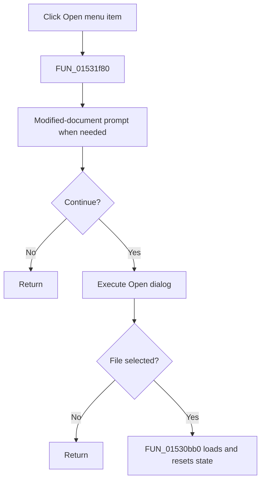

# &Open...

> Analysis status: Complete. The modified-document gate, open dialog, and loader establish the accepted and cancelled paths.

## Control

| Property | Recovered value |
| --- | --- |
| Form | NetlistEditor |
| Component path | NetlistEditor.MainMenu.MFile.MIOpen |
| Control class | TMenuItem |
| Caption | &Open... |
| Hint | Not present in the recovered resource. |
| Text | Not present in the recovered resource. |
| Handler name | MIOpenClick |
| Handler address | 01531f80 |
| Graph node | `resource:dfm:NetlistEditor/NetlistEditor.MainMenu.MFile.MIOpen` |
| Handler node | `function:01531f80` |
| Graph layer | UI |

## What happens when clicked

`FUN_01531f80` first calls `FUN_0152fa50`. If the editor is modified, that helper asks whether to save, cancel, or continue. Cancel stops the open action; the save choice calls the Save handler without checking its result.

When the gate allows the action, the handler executes the Open dialog. Dialog cancellation is a no-op. On acceptance, it reads the selected path and calls `FUN_01530bb0`, which updates the form file name, loads the editor text, clears the modified state and message list, refreshes circuit state, and updates recent-file and UI state. The handler does not inspect `Sender`, so menu and toolbar controls share this path.

## Click flow

## Handler evidence

- Source: [DecompiledSources/Tina16/functions/0000000001531F80__FUN_01531f80.c](../../../DecompiledSources/Tina16/functions/0000000001531F80__FUN_01531f80.c)
- Recovered role: Prompts as needed, selects a netlist file, and loads it into the editor.
- Current graph summary: Handles 2 Delphi UI events: NetlistEditor.BtnPanel.OpenButton.OnClick, NetlistEditor.MainMenu.MFile.MIOpen.OnClick.
- Current graph behavior: Not present in the recovered resource.
- Current graph evidence: Not present in the recovered resource.
- Complexity: complex
- Distinct outgoing calls: 4

## Direct calls

- `function:00414480` — Delphi UnicodeString clear and finalization helper
- `function:00724270` — FUN_00724270
- `function:0152fa50` — FUN_0152fa50
- `function:01530bb0` — FUN_01530bb0

## Resource evidence

- Kind: Not present in the recovered resource.
- Modal result: Not present in the recovered resource.
- Checked state: Not present in the recovered resource.
- List items: Not present in the recovered resource.
- Image reference: Not present in the recovered resource.
- Extracted glyph: None.

## Nearby label candidates

Nearby labels are layout candidates only. They are not proof of behavior.

- No same-parent label candidate is available.

## Analysis limits

- The handler does not inspect `Sender`; the menu item and toolbar button use the same dialog and state.
- The save choice in the modified-document prompt is called without a checked return value.
