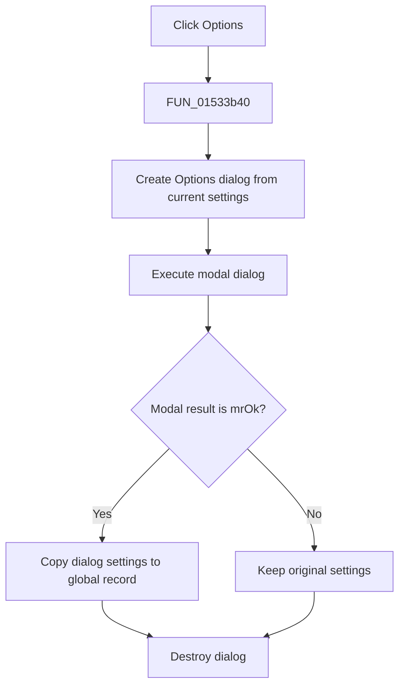

# &Options...

> Analysis status: Complete. The copied settings, modal-result test, and conditional commit establish the dialog transaction.

## Control

| Property | Recovered value |
| --- | --- |
| Form | NetlistEditor |
| Component path | NetlistEditor.MainMenu.MAnalysis.MIOption |
| Control class | TMenuItem |
| Caption | &Options... |
| Hint | Not present in the recovered resource. |
| Text | Not present in the recovered resource. |
| Handler name | MIOptionClick |
| Handler address | 01533b40 |
| Graph node | `resource:dfm:NetlistEditor/NetlistEditor.MainMenu.MAnalysis.MIOption` |
| Handler node | `function:01533b40` |
| Graph layer | UI |

## What happens when clicked

`FUN_01533b40` creates the recovered Options dialog class through `FUN_014f15b0`, passing the current global simulation-settings record. It executes the dialog modally and tests the result.

When the modal result is 1 (`mrOk`), the handler copies the dialog's settings record back to the global record. Other results leave the global record unchanged. The dialog is always destroyed.

## Click flow

## Handler evidence

- Source: [DecompiledSources/Tina16/functions/0000000001533B40__FUN_01533b40.c](../../../DecompiledSources/Tina16/functions/0000000001533B40__FUN_01533b40.c)
- Recovered role: Opens the Options dialog and commits its settings only when the dialog returns OK.
- Current graph summary: Handles 1 Delphi UI event: NetlistEditor.MainMenu.MAnalysis.MIOption.OnClick.
- Current graph behavior: Not present in the recovered resource.
- Current graph evidence: Not present in the recovered resource.
- Complexity: complex
- Distinct outgoing calls: 3

## Direct calls

- `function:00410f20` — Nil-safe Delphi object destruction helper
- `function:00417c40` — FUN_00417c40
- `function:014f15b0` — FUN_014f15b0

## Resource evidence

- Kind: Not present in the recovered resource.
- Modal result: Not present in the recovered resource.
- Checked state: Not present in the recovered resource.
- List items: Not present in the recovered resource.
- Image reference: Not present in the recovered resource.
- Extracted glyph: None.

## Nearby label candidates

Nearby labels are layout candidates only. They are not proof of behavior.

- No same-parent label candidate is available.

## Analysis limits

- The recovered settings record fields are not named in this wrapper.
- Validation and user-facing errors occur inside the Options dialog.
