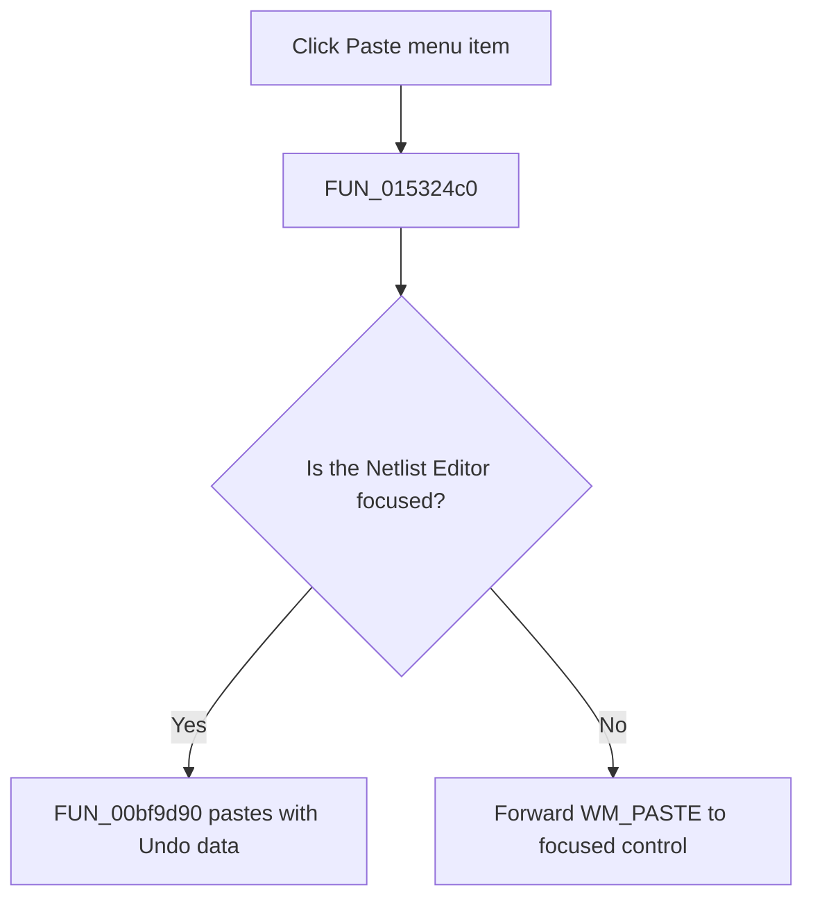

# &Paste

> Analysis status: Complete. The recovered focus test establishes the editor paste path and the forwarded Windows paste path.

## Control

| Property | Recovered value |
| --- | --- |
| Form | NetlistEditor |
| Component path | NetlistEditor.MainMenu.MEdit.MIPaste |
| Control class | TMenuItem |
| Caption | &Paste |
| Hint | Not present in the recovered resource. |
| Text | Not present in the recovered resource. |
| Handler name | MIPasteClick |
| Handler address | 015324c0 |
| Graph node | `resource:dfm:NetlistEditor/NetlistEditor.MainMenu.MEdit.MIPaste` |
| Handler node | `function:015324c0` |
| Graph layer | UI |

## What happens when clicked

`FUN_015324c0` compares the current focused control with the Netlist Editor. When the editor owns focus, it calls `FUN_00bf9d90`, which requires a writable editor and available text clipboard data, preserves SynEdit block mode, replaces or inserts text, records grouped Undo data, and refreshes caret and selection state.

When another control owns focus, the handler forwards Windows message `0x302` (`WM_PASTE`) to that control. The handler does not inspect `Sender`, so `MIPaste` and the toolbar control share this focus-dependent path.

## Click flow

## Handler evidence

- Source: [DecompiledSources/Tina16/functions/00000000015324C0__FUN_015324c0.c](../../../DecompiledSources/Tina16/functions/00000000015324C0__FUN_015324c0.c)
- Recovered role: Pastes into the Netlist Editor or forwards paste to the focused control.
- Current graph summary: Handles 2 Delphi UI events: NetlistEditor.BtnPanel.PasteButton.OnClick, NetlistEditor.MainMenu.MEdit.MIPaste.OnClick.
- Current graph behavior: Not present in the recovered resource.
- Current graph evidence: Not present in the recovered resource.
- Complexity: moderate
- Distinct outgoing calls: 2

## Direct calls

- `function:0065b870` — FUN_0065b870
- `function:00bf9d90` — FUN_00bf9d90

## Resource evidence

- Kind: Not present in the recovered resource.
- Modal result: Not present in the recovered resource.
- Checked state: Not present in the recovered resource.
- List items: Not present in the recovered resource.
- Image reference: Not present in the recovered resource.
- Extracted glyph: None.

## Nearby label candidates

Nearby labels are layout candidates only. They are not proof of behavior.

- No same-parent label candidate is available.

## Analysis limits

- The handler does not inspect `Sender`; focus, clipboard availability, read-only state, and selection mode decide the effect.
- The forwarded control handles its own paste errors and validation outside this wrapper.
