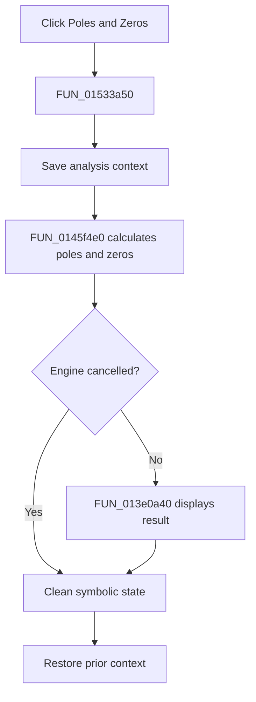

# Poles and Zeros

> Analysis status: Complete. The symbolic-engine initialization, calculation call, cancellation guard, and result display establish the action.

## Control

| Property | Recovered value |
| --- | --- |
| Form | NetlistEditor |
| Component path | NetlistEditor.MainMenu.MAnalysis.MISymbolic.MIPolesandZeros |
| Control class | TMenuItem |
| Caption | Poles and Zeros |
| Hint | Not present in the recovered resource. |
| Text | Not present in the recovered resource. |
| Handler name | MIPolesandZerosClick |
| Handler address | 01533a50 |
| Graph node | `resource:dfm:NetlistEditor/NetlistEditor.MainMenu.MAnalysis.MISymbolic.MIPolesandZeros` |
| Handler node | `function:01533a50` |
| Graph layer | UI |

## What happens when clicked

`FUN_01533a50` saves analysis context and calls `FUN_0145f4e0` with the active circuit. That routine initializes the symbolic engine in recovered mode 3, builds the analysis state, runs `FUN_0145e3a0`, and tests the engine cancellation byte.

When processing completes without cancellation, it calls `FUN_013e0a40` to display the result. It always performs symbolic-engine cleanup, and the wrapper restores the prior analysis context.

## Click flow

## Handler evidence

- Source: [DecompiledSources/Tina16/functions/0000000001533A50__FUN_01533a50.c](../../../DecompiledSources/Tina16/functions/0000000001533A50__FUN_01533a50.c)
- Recovered role: Calculates and displays symbolic poles and zeros.
- Current graph summary: Handles 1 Delphi UI event: NetlistEditor.MainMenu.MAnalysis.MISymbolic.MIPolesandZeros.OnClick.
- Current graph behavior: Not present in the recovered resource.
- Current graph evidence: Not present in the recovered resource.
- Complexity: complex
- Distinct outgoing calls: 3

## Direct calls

- `function:0145f4e0` — FUN_0145f4e0
- `function:0152fca0` — FUN_0152fca0
- `function:0152fd80` — FUN_0152fd80

## Resource evidence

- Kind: Not present in the recovered resource.
- Modal result: Not present in the recovered resource.
- Checked state: Not present in the recovered resource.
- List items: Not present in the recovered resource.
- Image reference: Not present in the recovered resource.
- Extracted glyph: None.

## Nearby label candidates

Nearby labels are layout candidates only. They are not proof of behavior.

- No same-parent label candidate is available.

## Analysis limits

- The exact polynomial and root algorithms are outside this wrapper.
- Cancellation produces no separate message in this path.
