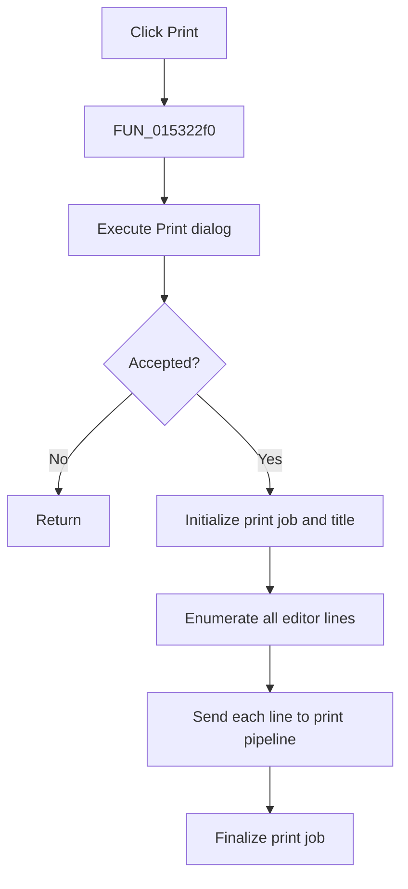

# &Print...

> Analysis status: Complete. The print-dialog gate, line enumeration, and recovered print-job lifecycle establish the action.

## Control

| Property | Recovered value |
| --- | --- |
| Form | NetlistEditor |
| Component path | NetlistEditor.MainMenu.MFile.MIPrint |
| Control class | TMenuItem |
| Caption | &Print... |
| Hint | Not present in the recovered resource. |
| Text | Not present in the recovered resource. |
| Handler name | MIPrintClick |
| Handler address | 015322f0 |
| Graph node | `resource:dfm:NetlistEditor/NetlistEditor.MainMenu.MFile.MIPrint` |
| Handler node | `function:015322f0` |
| Graph layer | UI |

## What happens when clicked

`FUN_015322f0` executes the Print dialog at form offset `+0x8c8`. Cancellation returns without starting a print job. On acceptance, it initializes the recovered print context, begins the print pipeline, obtains the document title from the editor, and applies it to the job.

The handler reads the editor line count and loops from index 0 through the final line. For each line, it obtains the text and sends it through the recovered print-line calls. It then closes the print context and finalizes the job. The wrapper has no local exception handler.

## Click flow

## Handler evidence

- Source: [DecompiledSources/Tina16/functions/00000000015322F0__FUN_015322f0.c](../../../DecompiledSources/Tina16/functions/00000000015322F0__FUN_015322f0.c)
- Recovered role: Prints every Netlist Editor line when the Print dialog is accepted.
- Current graph summary: Handles 1 Delphi UI event: NetlistEditor.MainMenu.MFile.MIPrint.OnClick.
- Current graph behavior: Not present in the recovered resource.
- Current graph evidence: Not present in the recovered resource.
- Complexity: complex
- Distinct outgoing calls: 11

## Direct calls

- `function:00409900` — FUN_00409900
- `function:0040ca00` — FUN_0040ca00
- `function:0040d150` — FUN_0040d150
- `function:0040f200` — FUN_0040f200
- `function:0040f590` — FUN_0040f590
- `function:00414480` — Delphi UnicodeString clear and finalization helper
- `function:005ff880` — FUN_005ff880
- `function:0069c880` — FUN_0069c880
- `function:0069db00` — FUN_0069db00
- `function:0069e8a0` — FUN_0069e8a0
- `function:00bf2c10` — FUN_00bf2c10

## Resource evidence

- Kind: Not present in the recovered resource.
- Modal result: Not present in the recovered resource.
- Checked state: Not present in the recovered resource.
- List items: Not present in the recovered resource.
- Image reference: Not present in the recovered resource.
- Extracted glyph: None.

## Nearby label candidates

Nearby labels are layout candidates only. They are not proof of behavior.

- No same-parent label candidate is available.

## Analysis limits

- Printer errors are handled below this wrapper; no status result is returned here.
- The exact recovered print-layout object types have no Delphi names.
