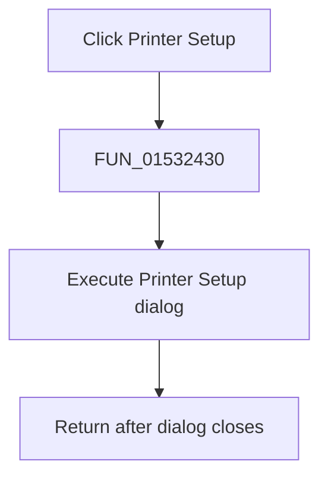

# Printer &Setup...

> Analysis status: Complete. The one virtual dialog call establishes the action.

## Control

| Property | Recovered value |
| --- | --- |
| Form | NetlistEditor |
| Component path | NetlistEditor.MainMenu.MFile.MIPrinterSetup |
| Control class | TMenuItem |
| Caption | Printer &Setup... |
| Hint | Not present in the recovered resource. |
| Text | Not present in the recovered resource. |
| Handler name | MIPrinterSetupClick |
| Handler address | 01532430 |
| Graph node | `resource:dfm:NetlistEditor/NetlistEditor.MainMenu.MFile.MIPrinterSetup` |
| Handler node | `function:01532430` |
| Graph layer | UI |

## What happens when clicked

`FUN_01532430` executes the object at form offset `+0x8d0` through virtual slot `+0xa8`, the same recovered dialog-execution slot used by the neighboring file dialogs.

The handler ignores the return value and performs no direct printer-state copy. Applying or cancelling printer settings is handled inside the dialog and printer subsystem.

## Click flow

## Handler evidence

- Source: [DecompiledSources/Tina16/functions/0000000001532430__FUN_01532430.c](../../../DecompiledSources/Tina16/functions/0000000001532430__FUN_01532430.c)
- Recovered role: Opens the Printer Setup dialog.
- Current graph summary: Handles 1 Delphi UI event: NetlistEditor.MainMenu.MFile.MIPrinterSetup.OnClick.
- Current graph behavior: Not present in the recovered resource.
- Current graph evidence: Not present in the recovered resource.
- Complexity: simple
- Distinct outgoing calls: 0

## Direct calls

- No direct call edge is present in the recovered graph.

## Resource evidence

- Kind: Not present in the recovered resource.
- Modal result: Not present in the recovered resource.
- Checked state: Not present in the recovered resource.
- List items: Not present in the recovered resource.
- Image reference: Not present in the recovered resource.
- Extracted glyph: None.

## Nearby label candidates

Nearby labels are layout candidates only. They are not proof of behavior.

- No same-parent label candidate is available.

## Analysis limits

- The dialog's Delphi component name is inferred from the bound control and neighboring file-dialog fields, not recovered from the call.
- The wrapper exposes no accepted/cancelled result.
