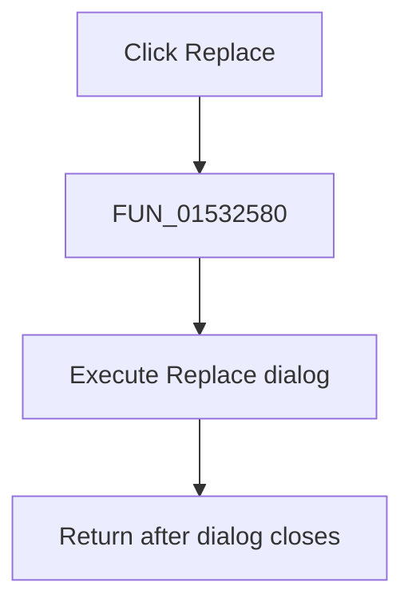

# &Replace...

> Analysis status: Complete. The one-call handler and recovered dialog execution slot establish the action.

## Control

| Property | Recovered value |
| --- | --- |
| Form | NetlistEditor |
| Component path | NetlistEditor.MainMenu.MEdit.MIReplace |
| Control class | TMenuItem |
| Caption | &Replace... |
| Hint | Not present in the recovered resource. |
| Text | Not present in the recovered resource. |
| Handler name | MIReplaceClick |
| Handler address | 01532580 |
| Graph node | `resource:dfm:NetlistEditor/NetlistEditor.MainMenu.MEdit.MIReplace` |
| Handler node | `function:01532580` |
| Graph layer | UI |

## What happens when clicked

`FUN_01532580` executes the dialog object at form offset `+0x8c0` through its virtual method at VMT offset `+0xa8`. The neighboring Find and Open handlers use the same slot for dialog execution.

The wrapper ignores the dialog result. Search and replacement behavior, validation, and messages are implemented by the dialog's event handlers, not this click wrapper.

## Click flow

## Handler evidence

- Source: [DecompiledSources/Tina16/functions/0000000001532580__FUN_01532580.c](../../../DecompiledSources/Tina16/functions/0000000001532580__FUN_01532580.c)
- Recovered role: Opens the Replace dialog.
- Current graph summary: Handles 1 Delphi UI event: NetlistEditor.MainMenu.MEdit.MIReplace.OnClick.
- Current graph behavior: Not present in the recovered resource.
- Current graph evidence: Not present in the recovered resource.
- Complexity: simple
- Distinct outgoing calls: 0

## Direct calls

- No direct call edge is present in the recovered graph.

## Resource evidence

- Kind: Not present in the recovered resource.
- Modal result: Not present in the recovered resource.
- Checked state: Not present in the recovered resource.
- List items: Not present in the recovered resource.
- Image reference: Not present in the recovered resource.
- Extracted glyph: None.

## Nearby label candidates

Nearby labels are layout candidates only. They are not proof of behavior.

- No same-parent label candidate is available.

## Analysis limits

- The Replace dialog's internal event flow is outside this handler.
- The wrapper does not expose a replacement count or success result.
