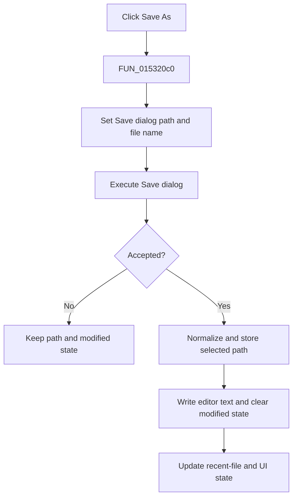

# Save &As...

> Analysis status: Complete. The Save dialog gate, path update, editor write, recent-file update, and cancel no-op establish the action.

## Control

| Property | Recovered value |
| --- | --- |
| Form | NetlistEditor |
| Component path | NetlistEditor.MainMenu.MFile.MISaveAs |
| Control class | TMenuItem |
| Caption | Save &As... |
| Hint | Not present in the recovered resource. |
| Text | Not present in the recovered resource. |
| Handler name | MISaveAsClick |
| Handler address | 015320c0 |
| Graph node | `resource:dfm:NetlistEditor/NetlistEditor.MainMenu.MFile.MISaveAs` |
| Handler node | `function:015320c0` |
| Graph layer | UI |

## What happens when clicked

`FUN_015320c0` builds the Save dialog's initial path from the current file name and recovered directory field, then executes the dialog. Cancellation returns after temporary-string cleanup without changing the document path or modified state.

On acceptance, it reads and normalizes the selected path, stores it as the current file name, writes the editor text to that path, clears the modified flag, updates the displayed path, and calls `FUN_01530440`. That helper replaces or inserts the path in the recent-file list, trims the list to five entries, and refreshes related menu/UI state.

## Click flow

## Handler evidence

- Source: [DecompiledSources/Tina16/functions/00000000015320C0__FUN_015320c0.c](../../../DecompiledSources/Tina16/functions/00000000015320C0__FUN_015320c0.c)
- Recovered role: Prompts for a path and saves the Netlist Editor document when accepted.
- Current graph summary: Handles 1 Delphi UI event: NetlistEditor.MainMenu.MFile.MISaveAs.OnClick.
- Current graph behavior: Not present in the recovered resource.
- Current graph evidence: Not present in the recovered resource.
- Complexity: complex
- Distinct outgoing calls: 12

## Direct calls

- `function:00414480` — Delphi UnicodeString clear and finalization helper
- `function:00414560` — Delphi UnicodeString array finalization helper
- `function:00414ad0` — Delphi UnicodeString assignment helper
- `function:0043e1a0` — FUN_0043e1a0
- `function:00441920` — FUN_00441920
- `function:00442f70` — FUN_00442f70
- `function:0064de00` — VCL control text setter with change suppression
- `function:00724270` — FUN_00724270
- `function:00724380` — FUN_00724380
- `function:00c0dad0` — FUN_00c0dad0
- `function:00c78ad0` — FUN_00c78ad0
- `function:01530440` — FUN_01530440

## Resource evidence

- Kind: Not present in the recovered resource.
- Modal result: Not present in the recovered resource.
- Checked state: Not present in the recovered resource.
- List items: Not present in the recovered resource.
- Image reference: Not present in the recovered resource.
- Extracted glyph: None.

## Nearby label candidates

Nearby labels are layout candidates only. They are not proof of behavior.

- No same-parent label candidate is available.

## Analysis limits

- The recovered wrapper has no local exception or explicit write-result check.
- File overwrite confirmation and path validation belong to the Save dialog.
