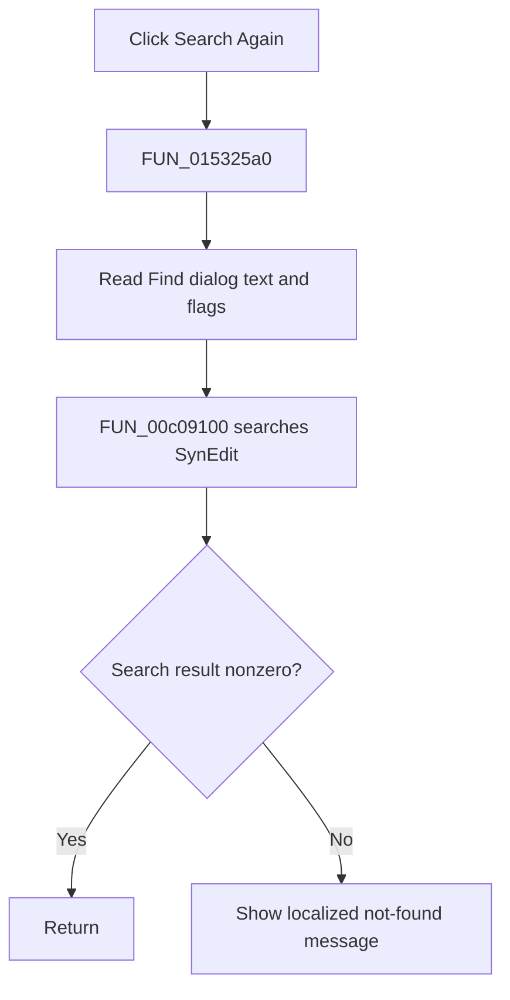

# Search &Again

> Analysis status: Complete. The recovered dialog-option read, SynEdit search call, and not-found message establish the action.

## Control

| Property | Recovered value |
| --- | --- |
| Form | NetlistEditor |
| Component path | NetlistEditor.MainMenu.MEdit.MISearchAgain |
| Control class | TMenuItem |
| Caption | Search &Again |
| Hint | Not present in the recovered resource. |
| Text | Not present in the recovered resource. |
| Handler name | MISearchAgainClick |
| Handler address | 015325a0 |
| Graph node | `resource:dfm:NetlistEditor/NetlistEditor.MainMenu.MEdit.MISearchAgain` |
| Handler node | `function:015325a0` |
| Graph layer | UI |

## What happens when clicked

`FUN_015325a0` calls `FUN_01533eb0` with the Netlist Editor and the Find dialog object. The callee reads the dialog's option flags and search text, converts them to recovered SynEdit search flags, and calls `FUN_00c09100` on the editor.

When the search returns zero, it builds and displays a localized not-found message that includes the current search text. A nonzero result returns without that message. The handler does not change the dialog settings.

## Click flow

## Handler evidence

- Source: [DecompiledSources/Tina16/functions/00000000015325A0__FUN_015325a0.c](../../../DecompiledSources/Tina16/functions/00000000015325A0__FUN_015325a0.c)
- Recovered role: Repeats the search using the current Find dialog text and options.
- Current graph summary: Handles 1 Delphi UI event: NetlistEditor.MainMenu.MEdit.MISearchAgain.OnClick.
- Current graph behavior: Not present in the recovered resource.
- Current graph evidence: Not present in the recovered resource.
- Complexity: simple
- Distinct outgoing calls: 1

## Direct calls

- `function:01533eb0` — Handles 2 Delphi UI events: NetlistEditor.FindDialog.OnFind, NetlistEditor.ReplaceDialog.OnFind.

## Resource evidence

- Kind: Not present in the recovered resource.
- Modal result: Not present in the recovered resource.
- Checked state: Not present in the recovered resource.
- List items: Not present in the recovered resource.
- Image reference: Not present in the recovered resource.
- Extracted glyph: None.

## Nearby label candidates

Nearby labels are layout candidates only. They are not proof of behavior.

- No same-parent label candidate is available.

## Analysis limits

- The exact mapping of all dialog option bits to SynEdit flags is recovered only as numeric masks.
- The wrapper exposes no match count.
