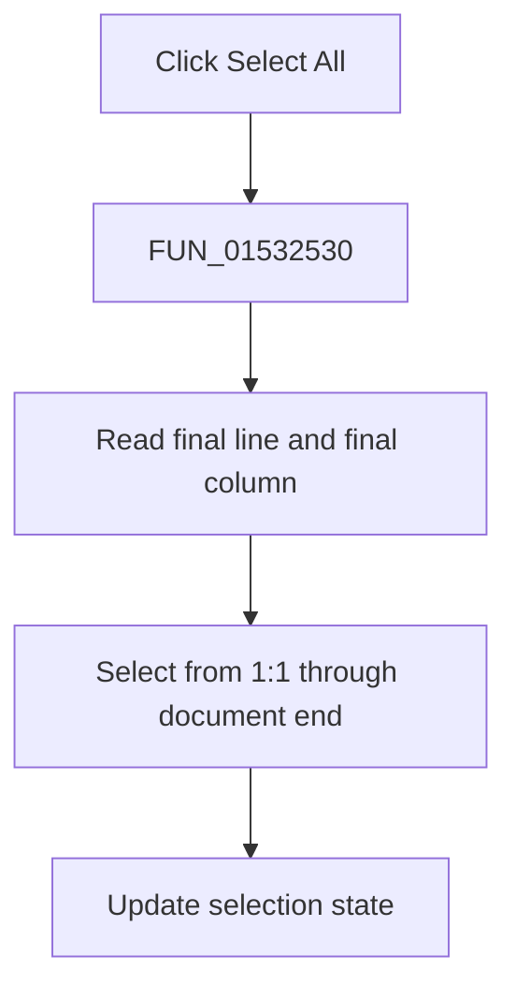

# &Select All

> Analysis status: Complete. The recovered document bounds and selection calls establish the action.

## Control

| Property | Recovered value |
| --- | --- |
| Form | NetlistEditor |
| Component path | NetlistEditor.MainMenu.MEdit.MISelectAll |
| Control class | TMenuItem |
| Caption | &Select All |
| Hint | Not present in the recovered resource. |
| Text | Not present in the recovered resource. |
| Handler name | MISelectAllClick |
| Handler address | 01532530 |
| Graph node | `resource:dfm:NetlistEditor/NetlistEditor.MainMenu.MEdit.MISelectAll` |
| Handler node | `function:01532530` |
| Graph layer | UI |

## What happens when clicked

`FUN_01532530` calls `FUN_00bfa390` for the editor. That routine builds a selection from line 1, column 1 through one column after the final character of the last line, applies both endpoints, and requests a selection-state update.

The path changes selection only. It does not alter document text or clipboard contents.

## Click flow

## Handler evidence

- Source: [DecompiledSources/Tina16/functions/0000000001532530__FUN_01532530.c](../../../DecompiledSources/Tina16/functions/0000000001532530__FUN_01532530.c)
- Recovered role: Selects all text in the Netlist Editor.
- Current graph summary: Handles 1 Delphi UI event: NetlistEditor.MainMenu.MEdit.MISelectAll.OnClick.
- Current graph behavior: Not present in the recovered resource.
- Current graph evidence: Not present in the recovered resource.
- Complexity: simple
- Distinct outgoing calls: 1

## Direct calls

- `function:00bfa390` — FUN_00bfa390

## Resource evidence

- Kind: Not present in the recovered resource.
- Modal result: Not present in the recovered resource.
- Checked state: Not present in the recovered resource.
- List items: Not present in the recovered resource.
- Image reference: Not present in the recovered resource.
- Extracted glyph: None.

## Nearby label candidates

Nearby labels are layout candidates only. They are not proof of behavior.

- No same-parent label candidate is available.

## Analysis limits

- The empty-document endpoint is handled inside the SynEdit routine.
- The handler does not copy the selected text.
