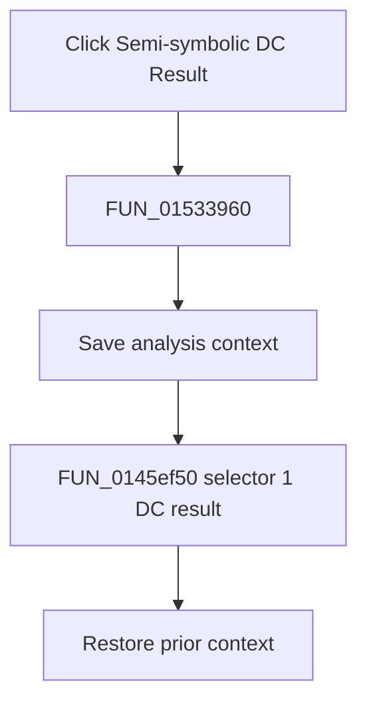

# Semi-symbolic DC Result

> Analysis status: Complete. The wrapper selector and recovered symbolic-result loop establish the semi-symbolic DC result path.

## Control

| Property | Recovered value |
| --- | --- |
| Form | NetlistEditor |
| Component path | NetlistEditor.MainMenu.MAnalysis.MISymbolic.MISemisymbolicDCResult |
| Control class | TMenuItem |
| Caption | Semi-symbolic DC Result |
| Hint | Not present in the recovered resource. |
| Text | Not present in the recovered resource. |
| Handler name | MISemisymbolicDCResultClick |
| Handler address | 01533960 |
| Graph node | `resource:dfm:NetlistEditor/NetlistEditor.MainMenu.MAnalysis.MISymbolic.MISemisymbolicDCResult` |
| Handler node | `function:01533960` |
| Graph layer | UI |

## What happens when clicked

`FUN_01533960` saves analysis context and calls `FUN_0145ef50` with selector 1. The callee initializes the DC symbolic-result pipeline and selects its selector-1 formatting routine for each processed entry. On completion without cancellation, it publishes the result text in the result/equation window.

The handler restores the prior context after the callee returns.

## Click flow

## Handler evidence

- Source: [DecompiledSources/Tina16/functions/0000000001533960__FUN_01533960.c](../../../DecompiledSources/Tina16/functions/0000000001533960__FUN_01533960.c)
- Recovered role: Generates and displays the DC result with semi-symbolic selector 1.
- Current graph summary: Handles 1 Delphi UI event: NetlistEditor.MainMenu.MAnalysis.MISymbolic.MISemisymbolicDCResult.OnClick.
- Current graph behavior: Not present in the recovered resource.
- Current graph evidence: Not present in the recovered resource.
- Complexity: complex
- Distinct outgoing calls: 3

## Direct calls

- `function:0145ef50` — FUN_0145ef50
- `function:0152fca0` — FUN_0152fca0
- `function:0152fd80` — FUN_0152fd80

## Resource evidence

- Kind: Not present in the recovered resource.
- Modal result: Not present in the recovered resource.
- Checked state: Not present in the recovered resource.
- List items: Not present in the recovered resource.
- Image reference: Not present in the recovered resource.
- Extracted glyph: None.

## Nearby label candidates

Nearby labels are layout candidates only. They are not proof of behavior.

- No same-parent label candidate is available.

## Analysis limits

- The exact symbolic terms retained by selector 1 are not named.
- Cancellation is handled inside the callee without a wrapper message.
