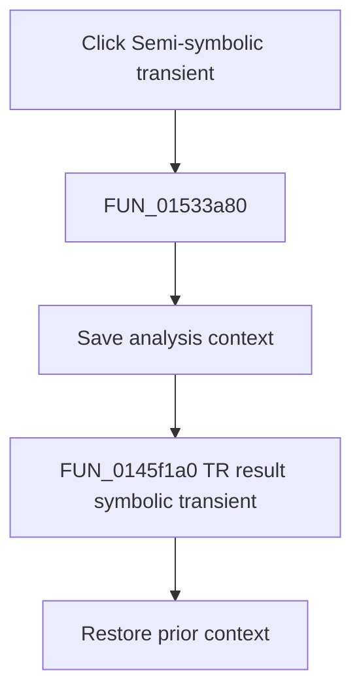

# Semi-symbolic transient

> Analysis status: Complete. The recovered title, symbolic transient loop, cancellation guard, and result publication establish the action.

## Control

| Property | Recovered value |
| --- | --- |
| Form | NetlistEditor |
| Component path | NetlistEditor.MainMenu.MAnalysis.MISymbolic.MISemisymbolicTransient |
| Control class | TMenuItem |
| Caption | Semi-symbolic transient |
| Hint | Not present in the recovered resource. |
| Text | Not present in the recovered resource. |
| Handler name | MISemisymbolicTransientClick |
| Handler address | 01533a80 |
| Graph node | `resource:dfm:NetlistEditor/NetlistEditor.MainMenu.MAnalysis.MISymbolic.MISemisymbolicTransient` |
| Handler node | `function:01533a80` |
| Graph layer | UI |

## What happens when clicked

`FUN_01533a80` saves analysis context and calls `FUN_0145f1a0` with the literal title `TR result:` and the active circuit. The callee initializes symbolic mode 3, processes transient expressions until completion or cancellation, normalizes each expression, and publishes the accumulated text in the result/equation window on completion.

The handler restores the prior context after the callee returns.

## Click flow

## Handler evidence

- Source: [DecompiledSources/Tina16/functions/0000000001533A80__FUN_01533a80.c](../../../DecompiledSources/Tina16/functions/0000000001533A80__FUN_01533a80.c)
- Recovered role: Generates and displays a semi-symbolic transient result.
- Current graph summary: Handles 1 Delphi UI event: NetlistEditor.MainMenu.MAnalysis.MISymbolic.MISemisymbolicTransient.OnClick.
- Current graph behavior: Not present in the recovered resource.
- Current graph evidence: Not present in the recovered resource.
- Complexity: complex
- Distinct outgoing calls: 3

## Direct calls

- `function:0145f1a0` — FUN_0145f1a0
- `function:0152fca0` — FUN_0152fca0
- `function:0152fd80` — FUN_0152fd80

## Resource evidence

- Kind: Not present in the recovered resource.
- Modal result: Not present in the recovered resource.
- Checked state: Not present in the recovered resource.
- List items: Not present in the recovered resource.
- Image reference: Not present in the recovered resource.
- Extracted glyph: None.

## Nearby label candidates

Nearby labels are layout candidates only. They are not proof of behavior.

- No same-parent label candidate is available.

## Analysis limits

- The exact transient expression transformations remain inside the symbolic engine.
- Cancellation is handled inside the callee without a wrapper message.
