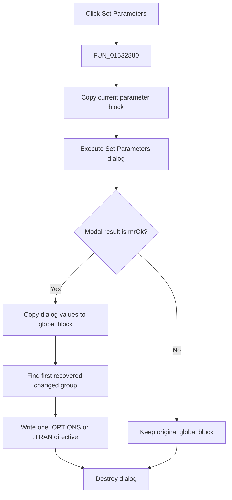

# &Set Parameters...

> Analysis status: Complete. The dialog copy, OK branch, global update, and directive-write chain establish the transaction.

## Control

| Property | Recovered value |
| --- | --- |
| Form | NetlistEditor |
| Component path | NetlistEditor.MainMenu.MAnalysis.MISetParameters |
| Control class | TMenuItem |
| Caption | &Set Parameters... |
| Hint | Not present in the recovered resource. |
| Text | Not present in the recovered resource. |
| Handler name | MISetParametersClick |
| Handler address | 01532880 |
| Graph node | `resource:dfm:NetlistEditor/NetlistEditor.MainMenu.MAnalysis.MISetParameters` |
| Handler node | `function:01532880` |
| Graph layer | UI |

## What happens when clicked

`FUN_01532880` captures current focus/context, validates the active document path, and copies 50 doubles plus a string from the global simulation parameter block. It creates the Set Parameters dialog with those values and executes it modally.

Only modal result 1 commits changes. The handler copies the dialog values back to the global block, then compares a recovered priority chain. It writes the first matched change as `.OPTIONS` with `TNOM`, `ABSTOL`, `VNTOL`, `RELTOL`, `PIVREL`, `PIVTOL`, `ITL1`, `ITL2`, `ITL4`, `CHGTOL`, `GMIN`, or `TRTOL`, or writes a `.TRAN` directive for the recovered transient group. Cancel leaves the copied global block unchanged. The dialog is always destroyed.

## Click flow

## Handler evidence

- Source: [DecompiledSources/Tina16/functions/0000000001532880__FUN_01532880.c](../../../DecompiledSources/Tina16/functions/0000000001532880__FUN_01532880.c)
- Recovered role: Edits simulation parameters and writes the first recovered changed directive after OK.
- Current graph summary: Handles 1 Delphi UI event: NetlistEditor.MainMenu.MAnalysis.MISetParameters.OnClick.
- Current graph behavior: Not present in the recovered resource.
- Current graph evidence: Not present in the recovered resource.
- Complexity: complex
- Distinct outgoing calls: 8

## Direct calls

- `function:00410f20` — Nil-safe Delphi object destruction helper
- `function:00414ad0` — Delphi UnicodeString assignment helper
- `function:0065b870` — FUN_0065b870
- `function:007f94c0` — FUN_007f94c0
- `function:007f95c0` — FUN_007f95c0
- `function:00ee4f70` — FUN_00ee4f70
- `function:01152540` — FUN_01152540
- `function:016cd2c0` — FUN_016cd2c0

## Resource evidence

- Kind: Not present in the recovered resource.
- Modal result: Not present in the recovered resource.
- Checked state: Not present in the recovered resource.
- List items: Not present in the recovered resource.
- Image reference: Not present in the recovered resource.
- Extracted glyph: None.

## Nearby label candidates

Nearby labels are layout candidates only. They are not proof of behavior.

- No same-parent label candidate is available.

## Analysis limits

- The dialog class and many parameter fields have no recovered Delphi names.
- The nested comparison chain writes at most one recovered directive per accepted dialog execution.
