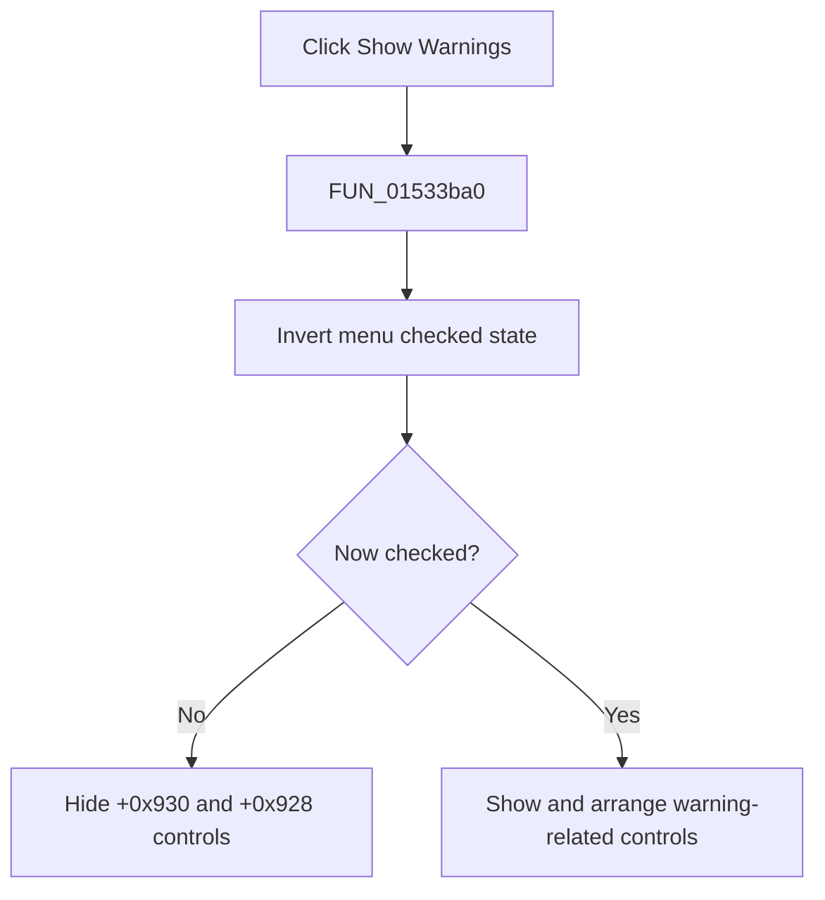

# Show &Warnings

> Analysis status: Complete. The recovered checked-state toggle and two visibility branches establish the action.

## Control

| Property | Recovered value |
| --- | --- |
| Form | NetlistEditor |
| Component path | NetlistEditor.MainMenu.MAnalysis.MIShowWarnings |
| Control class | TMenuItem |
| Caption | Show &Warnings |
| Hint | Not present in the recovered resource. |
| Text | Not present in the recovered resource. |
| Handler name | MIShowWarningsClick |
| Handler address | 01533ba0 |
| Graph node | `resource:dfm:NetlistEditor/NetlistEditor.MainMenu.MAnalysis.MIShowWarnings` |
| Handler node | `function:01533ba0` |
| Graph layer | UI |

## What happens when clicked

`FUN_01533ba0` reads the `MIShowWarnings` checked byte and calls the recovered `TMenuItem.SetChecked` routine with its inverse. It then reads the new state.

When unchecked, the handler hides the controls at form offsets `+0x930` and `+0x928`. When checked, it enables or shows the related editor/message controls and applies recovered indexes 1 and 2 through the UI helpers. The exact Delphi names of all affected layout controls are not recovered.

## Click flow

## Handler evidence

- Source: [DecompiledSources/Tina16/functions/0000000001533BA0__FUN_01533ba0.c](../../../DecompiledSources/Tina16/functions/0000000001533BA0__FUN_01533ba0.c)
- Recovered role: Toggles warning display controls and the menu item's checked state.
- Current graph summary: Handles 1 Delphi UI event: NetlistEditor.MainMenu.MAnalysis.MIShowWarnings.OnClick.
- Current graph behavior: Not present in the recovered resource.
- Current graph evidence: Not present in the recovered resource.
- Complexity: complex
- Distinct outgoing calls: 3

## Direct calls

- `function:0064c650` — FUN_0064c650
- `function:0064dbe0` — FUN_0064dbe0
- `function:007e2d20` — FUN_007e2d20

## Resource evidence

- Kind: Not present in the recovered resource.
- Modal result: Not present in the recovered resource.
- Checked state: Not present in the recovered resource.
- List items: Not present in the recovered resource.
- Image reference: Not present in the recovered resource.
- Extracted glyph: None.

## Nearby label candidates

Nearby labels are layout candidates only. They are not proof of behavior.

- No same-parent label candidate is available.

## Analysis limits

- The exact control class and role at form offset `+0x928` are not recovered.
- The handler changes display state only; it does not rerun ERC or compilation.
