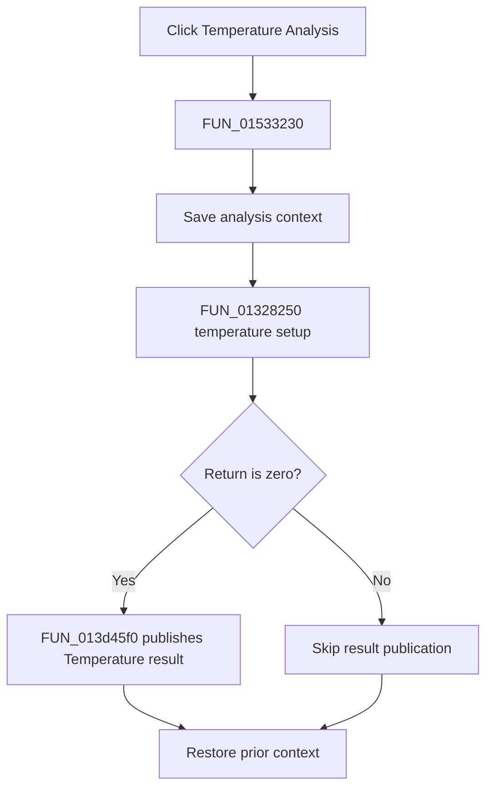

# &Temperature Analysis...

> Analysis status: Complete. The setup return branch and recovered Temperature result publisher establish the flow.

## Control

| Property | Recovered value |
| --- | --- |
| Form | NetlistEditor |
| Component path | NetlistEditor.MainMenu.MAnalysis.MIDCAnalysis.MITemperatureAnalysis |
| Control class | TMenuItem |
| Caption | &Temperature Analysis... |
| Hint | Not present in the recovered resource. |
| Text | Not present in the recovered resource. |
| Handler name | MITemperatureAnalysisClick |
| Handler address | 01533230 |
| Graph node | `resource:dfm:NetlistEditor/NetlistEditor.MainMenu.MAnalysis.MIDCAnalysis.MITemperatureAnalysis` |
| Handler node | `function:01533230` |
| Graph layer | UI |

## What happens when clicked

`FUN_01533230` saves analysis context in mode 0 and calls `FUN_01328250`. When the call returns zero, it passes the active result data to `FUN_013d45f0`, which creates a numbered `Temperature` result, registers `Analysis Result 1`, publishes it, and refreshes the application.

A nonzero return skips result publication. The handler restores the prior context on both branches.

## Click flow

## Handler evidence

- Source: [DecompiledSources/Tina16/functions/0000000001533230__FUN_01533230.c](../../../DecompiledSources/Tina16/functions/0000000001533230__FUN_01533230.c)
- Recovered role: Runs temperature-analysis setup and publishes a Temperature result on success.
- Current graph summary: Handles 1 Delphi UI event: NetlistEditor.MainMenu.MAnalysis.MIDCAnalysis.MITemperatureAnalysis.OnClick.
- Current graph behavior: Not present in the recovered resource.
- Current graph evidence: Not present in the recovered resource.
- Complexity: complex
- Distinct outgoing calls: 4

## Direct calls

- `function:01328250` — FUN_01328250
- `function:013d45f0` — FUN_013d45f0
- `function:0152fca0` — FUN_0152fca0
- `function:0152fd80` — FUN_0152fd80

## Resource evidence

- Kind: Not present in the recovered resource.
- Modal result: Not present in the recovered resource.
- Checked state: Not present in the recovered resource.
- List items: Not present in the recovered resource.
- Image reference: Not present in the recovered resource.
- Extracted glyph: None.

## Nearby label candidates

Nearby labels are layout candidates only. They are not proof of behavior.

- No same-parent label candidate is available.

## Analysis limits

- The exact meanings of nonzero setup returns are not recovered.
- Temperature sweep configuration remains inside `FUN_01328250`.
