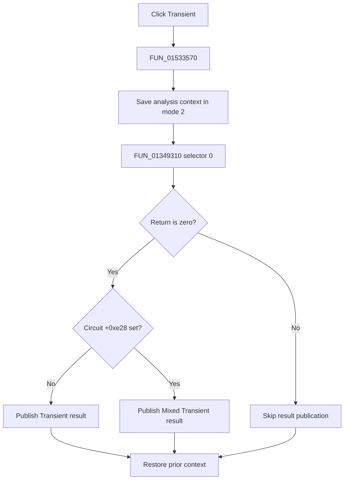

# &Transient...

> Analysis status: Complete. The setup return branch and normal-versus-mixed result branch establish the full flow.

## Control

| Property | Recovered value |
| --- | --- |
| Form | NetlistEditor |
| Component path | NetlistEditor.MainMenu.MAnalysis.MITransient |
| Control class | TMenuItem |
| Caption | &Transient... |
| Hint | Not present in the recovered resource. |
| Text | Not present in the recovered resource. |
| Handler name | MITransientClick |
| Handler address | 01533570 |
| Graph node | `resource:dfm:NetlistEditor/NetlistEditor.MainMenu.MAnalysis.MITransient` |
| Handler node | `function:01533570` |
| Graph layer | UI |

## What happens when clicked

`FUN_01533570` saves analysis context in mode 2 and calls `FUN_01349310` with analysis selector 0. A nonzero return skips result publication. On zero, the handler checks the active circuit byte at `+0xe28`.

When that byte is clear, it calls `FUN_013d2f60` to create and publish a `Transient` result. When set, it calls `FUN_013e5a30` with two recovered result-data fields to create and publish `Mixed Transient`. The handler restores the prior context on all paths.

## Click flow

## Handler evidence

- Source: [DecompiledSources/Tina16/functions/0000000001533570__FUN_01533570.c](../../../DecompiledSources/Tina16/functions/0000000001533570__FUN_01533570.c)
- Recovered role: Runs transient analysis and publishes a normal or mixed transient result.
- Current graph summary: Handles 1 Delphi UI event: NetlistEditor.MainMenu.MAnalysis.MITransient.OnClick.
- Current graph behavior: Not present in the recovered resource.
- Current graph evidence: Not present in the recovered resource.
- Complexity: complex
- Distinct outgoing calls: 5

## Direct calls

- `function:01349310` — FUN_01349310
- `function:013d2f60` — FUN_013d2f60
- `function:013e5a30` — FUN_013e5a30
- `function:0152fca0` — FUN_0152fca0
- `function:0152fd80` — FUN_0152fd80

## Resource evidence

- Kind: Not present in the recovered resource.
- Modal result: Not present in the recovered resource.
- Checked state: Not present in the recovered resource.
- List items: Not present in the recovered resource.
- Image reference: Not present in the recovered resource.
- Extracted glyph: None.

## Nearby label candidates

Nearby labels are layout candidates only. They are not proof of behavior.

- No same-parent label candidate is available.

## Analysis limits

- The exact meanings of nonzero setup returns are not recovered.
- The Delphi name and meaning of circuit byte `+0xe28` are not recovered beyond its normal-versus-mixed branch.
