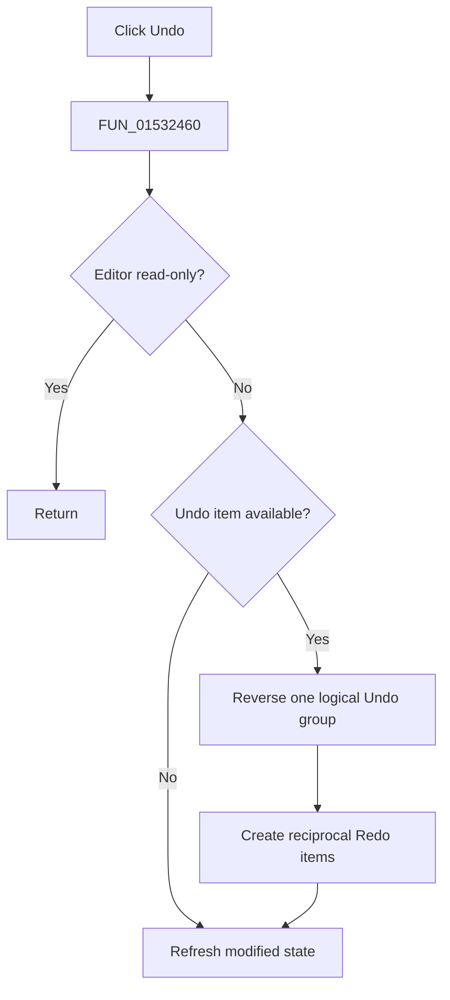

# &Undo

> Analysis status: Complete. The annotated SynEdit Undo routine establishes the read-only guard, grouping rules, state restoration, and empty-stack no-op.

## Control

| Property | Recovered value |
| --- | --- |
| Form | NetlistEditor |
| Component path | NetlistEditor.MainMenu.MEdit.MIUndo |
| Control class | TMenuItem |
| Caption | &Undo |
| Hint | Not present in the recovered resource. |
| Text | Not present in the recovered resource. |
| Handler name | MIUndoClick |
| Handler address | 01532460 |
| Graph node | `resource:dfm:NetlistEditor/NetlistEditor.MainMenu.MEdit.MIUndo` |
| Handler node | `function:01532460` |
| Graph layer | UI |

## What happens when clicked

`FUN_01532460` calls `FUN_00c00ff0` for the editor. That routine returns for a read-only editor. Otherwise, it interprets group-break and paired begin/end markers, change numbers, and the recovered same-reason grouping option to reverse one logical group.

Each consumed item restores its recorded text, caret, selection, and selection-mode state as applicable and creates reciprocal Redo data. An empty Undo stack changes no content. The routine refreshes modified state against the saved initial-state marker.

## Click flow

## Handler evidence

- Source: [DecompiledSources/Tina16/functions/0000000001532460__FUN_01532460.c](../../../DecompiledSources/Tina16/functions/0000000001532460__FUN_01532460.c)
- Recovered role: Undoes one logical SynEdit edit group and creates reciprocal Redo data.
- Current graph summary: Handles 1 Delphi UI event: NetlistEditor.MainMenu.MEdit.MIUndo.OnClick.
- Current graph behavior: Not present in the recovered resource.
- Current graph evidence: Not present in the recovered resource.
- Complexity: simple
- Distinct outgoing calls: 1

## Direct calls

- `function:00c00ff0` — FUN_00c00ff0

## Resource evidence

- Kind: Not present in the recovered resource.
- Modal result: Not present in the recovered resource.
- Checked state: Not present in the recovered resource.
- List items: Not present in the recovered resource.
- Image reference: Not present in the recovered resource.
- Extracted glyph: None.

## Nearby label candidates

Nearby labels are layout candidates only. They are not proof of behavior.

- No same-parent label candidate is available.

## Analysis limits

- Exact Undo item reason names are recovered only for selected grouping markers.
- The wrapper has no user-facing message for an empty Undo stack.
