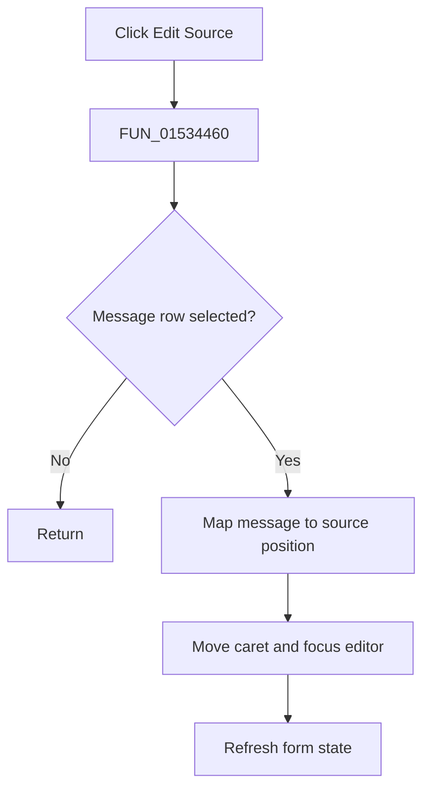

# &Edit Source

> Analysis status: Complete. The list-selection guard and recovered source-location mapping establish the navigation path.

## Control

| Property | Recovered value |
| --- | --- |
| Form | NetlistEditor |
| Component path | NetlistEditor.ListBoxPopup.pmiEditSource |
| Control class | TMenuItem |
| Caption | &Edit Source |
| Hint | Not present in the recovered resource. |
| Text | Not present in the recovered resource. |
| Handler name | pmiEditSourceClick |
| Handler address | 01534460 |
| Graph node | `resource:dfm:NetlistEditor/NetlistEditor.ListBoxPopup.pmiEditSource` |
| Handler node | `function:01534460` |
| Graph layer | UI |

## What happens when clicked

`FUN_01534460` delegates to `FUN_015341c0`. That routine reads the selected message index and returns when no item is selected. For a selected row, it obtains the message text and attached object data. It derives a character position either from the text or through `FUN_016cef60`, stores the position at form offset `+0x1c04`, moves the SynEdit caret, clears selection mode, focuses the editor, and refreshes the form state.

The recovered code has no separate message when a row has no selection. Some message-location object types remain unnamed.

## Click flow

## Handler evidence

- Source: [DecompiledSources/Tina16/functions/0000000001534460__FUN_01534460.c](../../../DecompiledSources/Tina16/functions/0000000001534460__FUN_01534460.c)
- Recovered role: Navigates the editor to the source location for the selected message.
- Current graph summary: Handles 1 Delphi UI event: NetlistEditor.ListBoxPopup.pmiEditSource.OnClick.
- Current graph behavior: Not present in the recovered resource.
- Current graph evidence: Not present in the recovered resource.
- Complexity: simple
- Distinct outgoing calls: 1

## Direct calls

- `function:015341c0` — Handles 1 Delphi UI event: NetlistEditor.ListBox.OnDblClick.

## Resource evidence

- Kind: Not present in the recovered resource.
- Modal result: Not present in the recovered resource.
- Checked state: Not present in the recovered resource.
- List items: Not present in the recovered resource.
- Image reference: Not present in the recovered resource.
- Extracted glyph: None.

## Nearby label candidates

Nearby labels are layout candidates only. They are not proof of behavior.

- No same-parent label candidate is available.

## Analysis limits

- The exact class of the attached message-location object is not recovered.
- When there is no selected row, the action is a proven no-op.
