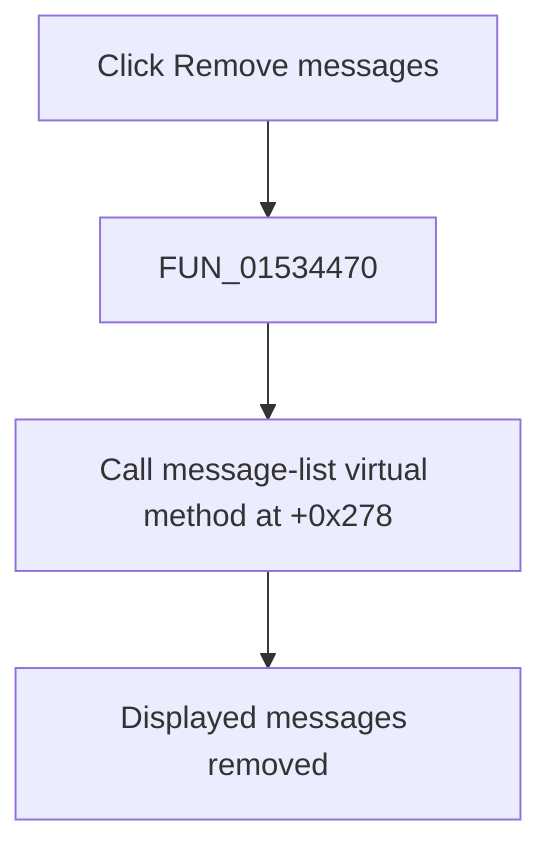

# &Remove messages

> Analysis status: Complete. The one-call handler and matching reset callers establish the message-list clear action.

## Control

| Property | Recovered value |
| --- | --- |
| Form | NetlistEditor |
| Component path | NetlistEditor.ListBoxPopup.pmiRemoveMessages |
| Control class | TMenuItem |
| Caption | &Remove messages |
| Hint | Not present in the recovered resource. |
| Text | Not present in the recovered resource. |
| Handler name | pmiRemoveMessagesClick |
| Handler address | 01534470 |
| Graph node | `resource:dfm:NetlistEditor/NetlistEditor.ListBoxPopup.pmiRemoveMessages` |
| Handler node | `function:01534470` |
| Graph layer | UI |

## What happens when clicked

`FUN_01534470` invokes the zero-argument virtual method at VMT offset `+0x278` on the control at form offset `+0x930`, which the form resource identifies as the message list. The New and Open reset paths call the same slot on the same field before rebuilding editor state.

The recovered VCL method name is not present. The call shape and repeated reset use establish removal of all displayed messages; the handler has no selection branch or confirmation.

## Click flow

## Handler evidence

- Source: [DecompiledSources/Tina16/functions/0000000001534470__FUN_01534470.c](../../../DecompiledSources/Tina16/functions/0000000001534470__FUN_01534470.c)
- Recovered role: Clears the Netlist Editor message list.
- Current graph summary: Handles 1 Delphi UI event: NetlistEditor.ListBoxPopup.pmiRemoveMessages.OnClick.
- Current graph behavior: Not present in the recovered resource.
- Current graph evidence: Not present in the recovered resource.
- Complexity: simple
- Distinct outgoing calls: 0

## Direct calls

- No direct call edge is present in the recovered graph.

## Resource evidence

- Kind: Not present in the recovered resource.
- Modal result: Not present in the recovered resource.
- Checked state: Not present in the recovered resource.
- List items: Not present in the recovered resource.
- Image reference: Not present in the recovered resource.
- Extracted glyph: None.

## Nearby label candidates

Nearby labels are layout candidates only. They are not proof of behavior.

- No same-parent label candidate is available.

## Analysis limits

- The exact VCL method name at slot `+0x278` is not recovered.
- The handler clears the displayed list; it does not prove deletion of any persisted diagnostic store.
