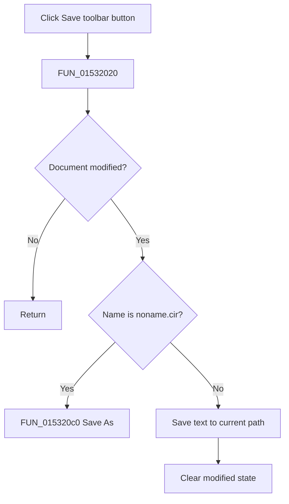

# Save

> Analysis status: Complete. The modified flag, default-name branch, and editor save call establish the save and no-op paths.

## Control

| Property | Recovered value |
| --- | --- |
| Form | NetlistEditor |
| Component path | NetlistEditor.BtnPanel.SaveButton |
| Control class | TSpeedButton |
| Caption | Not present in the recovered resource. |
| Hint | Save |
| Text | Not present in the recovered resource. |
| Handler name | MISaveClick |
| Handler address | 01532020 |
| Graph node | `resource:dfm:NetlistEditor/NetlistEditor.BtnPanel.SaveButton` |
| Handler node | `function:01532020` |
| Graph layer | UI |

## What happens when clicked

`FUN_01532020` returns immediately when the editor's modified byte at `+0x5e0` is clear. For a modified document named `noname.cir`, it delegates to `FUN_015320c0` for Save As.

For another path, it invokes the editor text object's save virtual method with the current file name, then clears the modified state. The handler does not inspect `Sender`, so the toolbar control and `MISave` use the same path.

## Click flow

## Handler evidence

- Source: [DecompiledSources/Tina16/functions/0000000001532020__FUN_01532020.c](../../../DecompiledSources/Tina16/functions/0000000001532020__FUN_01532020.c)
- Recovered role: Saves a modified netlist, using Save As for the default name.
- Current graph summary: Handles 2 Delphi UI events: NetlistEditor.BtnPanel.SaveButton.OnClick, NetlistEditor.MainMenu.MFile.MISave.OnClick.
- Current graph behavior: Not present in the recovered resource.
- Current graph evidence: Not present in the recovered resource.
- Complexity: complex
- Distinct outgoing calls: 3

## Direct calls

- `function:00416db0` — FUN_00416db0
- `function:00c0dad0` — FUN_00c0dad0
- `function:015320c0` — Handles 1 Delphi UI event: NetlistEditor.MainMenu.MFile.MISaveAs.OnClick.

## Resource evidence

- Kind: Not present in the recovered resource.
- Modal result: Not present in the recovered resource.
- Checked state: Not present in the recovered resource.
- List items: Not present in the recovered resource.
- Image reference: Not present in the recovered resource.
- Extracted glyph: [`0279_NetlistEditor_NetlistEditor_BtnPanel_SaveButton_Glyph_Data.png`](../../../glyph/0279_NetlistEditor_NetlistEditor_BtnPanel_SaveButton_Glyph_Data.png)

## Nearby label candidates

Nearby labels are layout candidates only. They are not proof of behavior.

- No same-parent label candidate is available.

## Analysis limits

- The handler does not inspect `Sender`; the toolbar button and menu item use the same file state.
- The recovered wrapper has no local exception or explicit write-result check.
