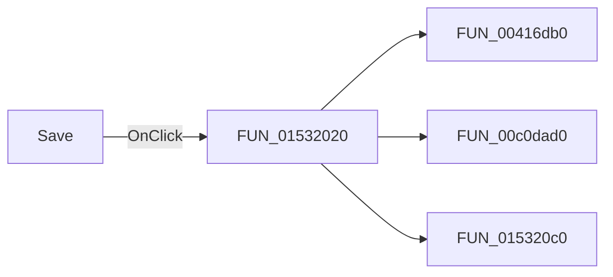

# Save

> Analysis status: Pending individual source review.

## Control

| Property | Recovered value |
| --- | --- |
| Form | NetlistEditor |
| Component path | NetlistEditor.BtnPanel.SaveButton |
| Control class | TSpeedButton |
| Caption | Not present in the recovered resource. |
| Hint | Save |
| Text | Not present in the recovered resource. |
| Handler name | MISaveClick |
| Handler address | 01532020 |
| Graph node | `resource:dfm:NetlistEditor/NetlistEditor.BtnPanel.SaveButton` |
| Handler node | `function:01532020` |
| Graph layer | UI |

## What happens when clicked

Pending individual analysis. An agent must read the recovered handler source and its relevant callees before it replaces this text.

## Click flow

## Handler evidence

- Source: [DecompiledSources/Tina16/functions/0000000001532020__FUN_01532020.c](../../../DecompiledSources/Tina16/functions/0000000001532020__FUN_01532020.c)
- Recovered role: Not present in the recovered resource.
- Current graph summary: Handles 2 Delphi UI events: NetlistEditor.BtnPanel.SaveButton.OnClick, NetlistEditor.MainMenu.MFile.MISave.OnClick.
- Current graph behavior: Not present in the recovered resource.
- Current graph evidence: Not present in the recovered resource.
- Complexity: complex
- Distinct outgoing calls: 3

## Direct calls

- `function:00416db0` — FUN_00416db0
- `function:00c0dad0` — FUN_00c0dad0
- `function:015320c0` — Handles 1 Delphi UI event: NetlistEditor.MainMenu.MFile.MISaveAs.OnClick.

## Resource evidence

- Kind: Not present in the recovered resource.
- Modal result: Not present in the recovered resource.
- Checked state: Not present in the recovered resource.
- List items: Not present in the recovered resource.
- Image reference: Not present in the recovered resource.
- Extracted glyph: [`0279_NetlistEditor_NetlistEditor_BtnPanel_SaveButton_Glyph_Data.png`](../../../glyph/0279_NetlistEditor_NetlistEditor_BtnPanel_SaveButton_Glyph_Data.png)

## Nearby label candidates

Nearby labels are layout candidates only. They are not proof of behavior.

- No same-parent label candidate is available.

## Analysis limits

- Do not infer behavior from the control class, caption, hint, glyph, or nearby label alone.
- Do not replace the pending status until the handler source and relevant call path provide enough evidence.
