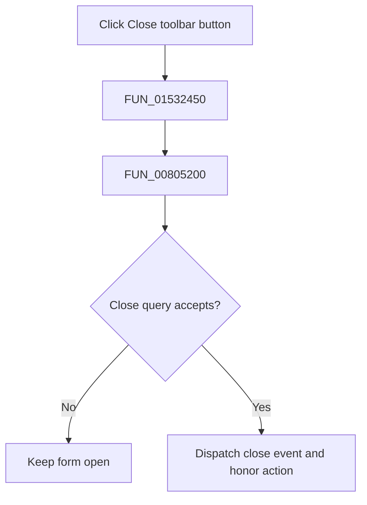

# Close (Ctrl+F4)

> Analysis status: Complete. The shared handler and recovered VCL close routine establish close-query, cancel, and close-action behavior.

## Control

| Property | Recovered value |
| --- | --- |
| Form | NetlistEditor |
| Component path | NetlistEditor.BtnPanel.ToolClose |
| Control class | TSpeedButton |
| Caption | Not present in the recovered resource. |
| Hint | Close (Ctrl+F4) |
| Text | Not present in the recovered resource. |
| Handler name | MIExitClick |
| Handler address | 01532450 |
| Graph node | `resource:dfm:NetlistEditor/NetlistEditor.BtnPanel.ToolClose` |
| Handler node | `function:01532450` |
| Graph layer | UI |

## What happens when clicked

`FUN_01532450` calls `FUN_00805200`, the recovered VCL form close routine. For a modeless form, it runs the virtual close query and returns if closure is rejected. Otherwise, it dispatches the form close event and honors the resulting hide, minimize, release, or main-form termination action.

The handler does not inspect `Sender`, so the toolbar close button and `MIExit` use the same close path. Any modified-document prompt belongs to the form's close-query event, not this wrapper.

## Click flow

## Handler evidence

- Source: [DecompiledSources/Tina16/functions/0000000001532450__FUN_01532450.c](../../../DecompiledSources/Tina16/functions/0000000001532450__FUN_01532450.c)
- Recovered role: Closes the Netlist Editor through the VCL form close pipeline.
- Current graph summary: Handles 2 Delphi UI events: NetlistEditor.BtnPanel.ToolClose.OnClick, NetlistEditor.MainMenu.MFile.MIExit.OnClick.
- Current graph behavior: Not present in the recovered resource.
- Current graph evidence: Not present in the recovered resource.
- Complexity: simple
- Distinct outgoing calls: 1

## Direct calls

- `function:00805200` — FUN_00805200

## Resource evidence

- Kind: Not present in the recovered resource.
- Modal result: Not present in the recovered resource.
- Checked state: Not present in the recovered resource.
- List items: Not present in the recovered resource.
- Image reference: Not present in the recovered resource.
- Extracted glyph: [`0283_NetlistEditor_NetlistEditor_BtnPanel_ToolClose_Glyph_Data.png`](../../../glyph/0283_NetlistEditor_NetlistEditor_BtnPanel_ToolClose_Glyph_Data.png)

## Nearby label candidates

Nearby labels are layout candidates only. They are not proof of behavior.

- No same-parent label candidate is available.

## Analysis limits

- The handler does not inspect `Sender`; both controls enter the same VCL close pipeline.
- The exact NetlistEditor close-query handler is outside this recovered wrapper.
