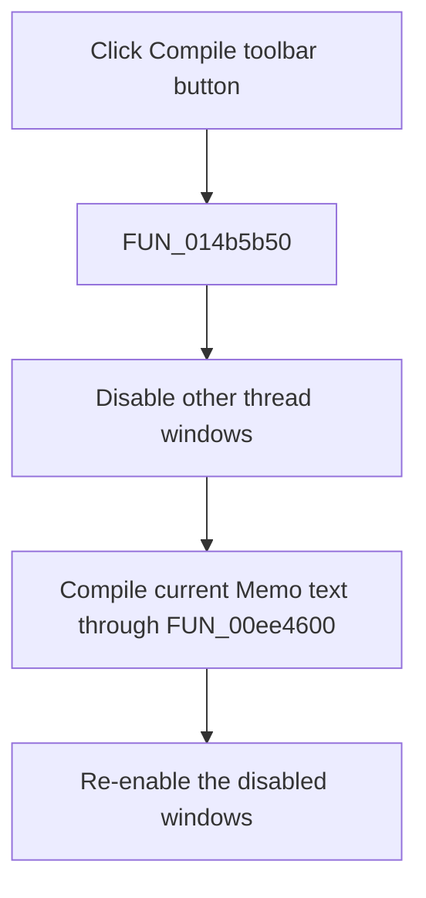

# Compile

> Analysis status: Reviewed from the recovered handler, compiler call path, and form resource.

## Control

| Property | Recovered value |
| --- | --- |
| Form | NetlistViewer |
| Component path | NetlistViewer.BtnPanel.CompileButton |
| Control class | TSpeedButton |
| Caption | Not present in the recovered resource. |
| Hint | Compile |
| Text | Not present in the recovered resource. |
| Handler name | MICompileClick |
| Handler address | 014b5b50 |
| Graph node | `resource:dfm:NetlistViewer/NetlistViewer.BtnPanel.CompileButton` |
| Handler node | `function:014b5b50` |
| Graph layer | UI |

## What happens when clicked

The toolbar button runs the same branch-free handler as the **Compile** menu item. The handler temporarily disables the other thread windows, passes the current `Memo` text, the form's netlist state, and the recovered compile options to `FUN_00ee4600`, and then re-enables the windows. It keeps no result in the button. The compiler and message objects own the produced netlist and diagnostics. The handler has no `Sender` test, cancel branch, or local error dialog.

## Click flow

## Handler evidence

- Source: [DecompiledSources/Tina16/functions/00000000014B5B50__FUN_014b5b50.c](../../../DecompiledSources/Tina16/functions/00000000014B5B50__FUN_014b5b50.c)
- Recovered role: Compile the current Netlist Viewer source.
- Current graph summary: Handles 2 Delphi UI events: NetlistViewer.BtnPanel.CompileButton.OnClick, NetlistViewer.MainMenu.MAnalysis.MICompile.OnClick.
- Current graph behavior: Not present in the recovered resource.
- Current graph evidence: Not present in the recovered resource.
- Complexity: complex
- Distinct outgoing calls: 5

## Direct calls

- `function:00414480` — Delphi UnicodeString clear and finalization helper
- `function:0065b870` — FUN_0065b870
- `function:007f94c0` — FUN_007f94c0
- `function:007f95c0` — FUN_007f95c0
- `function:00ee4600` — FUN_00ee4600

## Resource evidence

- Kind: Not present in the recovered resource.
- Modal result: Not present in the recovered resource.
- Checked state: Not present in the recovered resource.
- List items: Not present in the recovered resource.
- Image reference: Not present in the recovered resource.
- Extracted glyph: [`0285_NetlistViewer_NetlistViewer_BtnPanel_CompileButton_Glyph_Data.png`](../../../glyph/0285_NetlistViewer_NetlistViewer_BtnPanel_CompileButton_Glyph_Data.png)

## Nearby label candidates

Nearby labels are layout candidates only. They are not proof of behavior.

- No same-parent label candidate is available.

## Analysis limits

- `FUN_00ee4600` is recovered as the shared compile front end, but names for its option record fields are not recovered.
- The toolbar glyph supports the compile intent but does not add a separate behavior branch.
