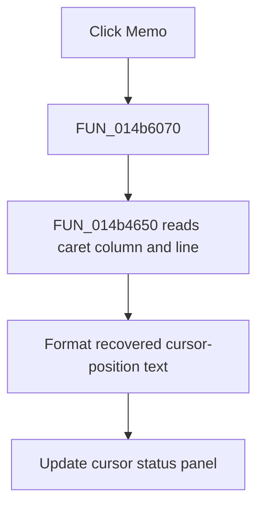

# Memo

> Analysis status: Reviewed from the click wrapper, caret-position helper, and form resource.

## Control

| Property | Recovered value |
| --- | --- |
| Form | NetlistViewer |
| Component path | NetlistViewer.Memo |
| Control class | TSynEdit |
| Caption | Not present in the recovered resource. |
| Hint | Not present in the recovered resource. |
| Text | Not present in the recovered resource. |
| Handler name | MemoClick |
| Handler address | 014b6070 |
| Graph node | `resource:dfm:NetlistViewer/NetlistViewer.Memo` |
| Handler node | `function:014b6070` |
| Graph layer | UI |

## What happens when clicked

Clicking `Memo` refreshes the cursor status display. The shared helper reads the SynEdit caret column and line, formats them with the form's recovered cursor-position template, and writes the result to the cursor panel. The click wrapper does not change text, selection, modified state, or messages. Normal SynEdit caret placement happens before or around this event through the control itself.

## Click flow

## Handler evidence

- Source: [DecompiledSources/Tina16/functions/00000000014B6070__FUN_014b6070.c](../../../DecompiledSources/Tina16/functions/00000000014B6070__FUN_014b6070.c)
- Recovered role: Refresh the Netlist Viewer cursor-position display.
- Current graph summary: Handles 1 Delphi UI event: NetlistViewer.Memo.OnClick.
- Current graph behavior: Not present in the recovered resource.
- Current graph evidence: Not present in the recovered resource.
- Complexity: simple
- Distinct outgoing calls: 1

## Direct calls

- `function:014b4650` — FUN_014b4650

## Resource evidence

- Kind: Not present in the recovered resource.
- Modal result: Not present in the recovered resource.
- Checked state: Not present in the recovered resource.
- List items: Not present in the recovered resource.
- Image reference: Not present in the recovered resource.
- Extracted glyph: None.

## Nearby label candidates

Nearby labels are layout candidates only. They are not proof of behavior.

- No same-parent label candidate is available.

## Analysis limits

- The format template is constructed from localized resources during form creation; its exact displayed wording is not present in this article.
- The handler reports the caret after the click but does not own the SynEdit mouse-placement logic.
