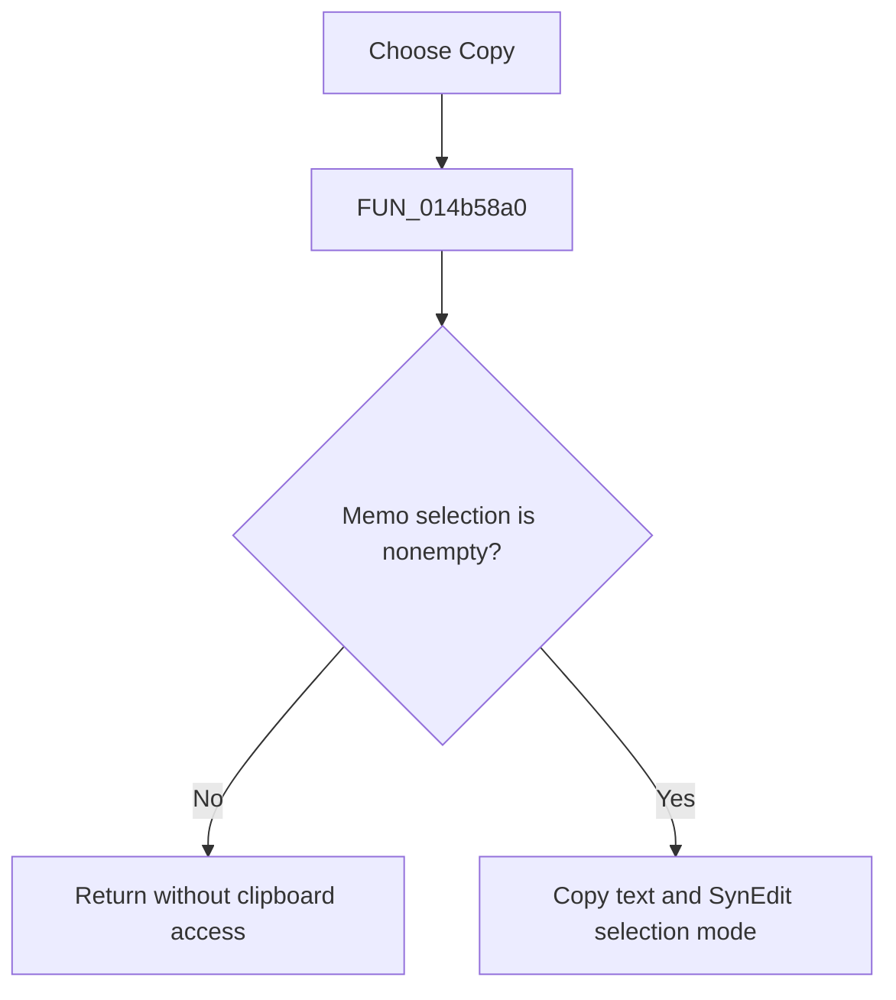

# &Copy

> Analysis status: Reviewed from the recovered handler and SynEdit clipboard path.

## Control

| Property | Recovered value |
| --- | --- |
| Form | NetlistViewer |
| Component path | NetlistViewer.MainMenu.MEdit.MICopy |
| Control class | TMenuItem |
| Caption | &Copy |
| Hint | Not present in the recovered resource. |
| Text | Not present in the recovered resource. |
| Handler name | MICopyClick |
| Handler address | 014b58a0 |
| Graph node | `resource:dfm:NetlistViewer/NetlistViewer.MainMenu.MEdit.MICopy` |
| Handler node | `function:014b58a0` |
| Graph layer | UI |

## What happens when clicked

The menu item calls the same branch-free handler as the toolbar **Copy** button. It copies a nonempty `Memo` selection to the standard clipboard and adds SynEdit selection-mode data. An empty selection is a no-op. It does not change the document or its modified state.

## Click flow

## Handler evidence

- Source: [DecompiledSources/Tina16/functions/00000000014B58A0__FUN_014b58a0.c](../../../DecompiledSources/Tina16/functions/00000000014B58A0__FUN_014b58a0.c)
- Recovered role: Copy the selected Netlist Viewer text.
- Current graph summary: Handles 2 Delphi UI events: NetlistViewer.BtnPanel.CopyButton.OnClick, NetlistViewer.MainMenu.MEdit.MICopy.OnClick.
- Current graph behavior: Not present in the recovered resource.
- Current graph evidence: Not present in the recovered resource.
- Complexity: simple
- Distinct outgoing calls: 1

## Direct calls

- `function:00bf1d60` — FUN_00bf1d60

## Resource evidence

- Kind: Not present in the recovered resource.
- Modal result: Not present in the recovered resource.
- Checked state: Not present in the recovered resource.
- List items: Not present in the recovered resource.
- Image reference: Not present in the recovered resource.
- Extracted glyph: None.

## Nearby label candidates

Nearby labels are layout candidates only. They are not proof of behavior.

- No same-parent label candidate is available.

## Analysis limits

- The menu entry and toolbar button have the same handler and no sender-dependent branch.
- Clipboard allocation or publication errors follow the normal Delphi exception path.
