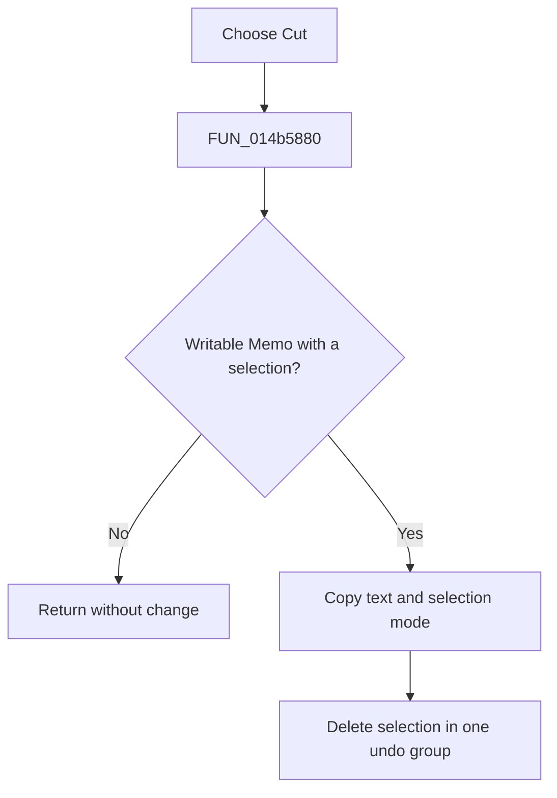

# Cu&t

> Analysis status: Reviewed from the recovered handler and SynEdit cut engine.

## Control

| Property | Recovered value |
| --- | --- |
| Form | NetlistViewer |
| Component path | NetlistViewer.MainMenu.MEdit.MICut |
| Control class | TMenuItem |
| Caption | Cu&t |
| Hint | Not present in the recovered resource. |
| Text | Not present in the recovered resource. |
| Handler name | MICutClick |
| Handler address | 014b5880 |
| Graph node | `resource:dfm:NetlistViewer/NetlistViewer.MainMenu.MEdit.MICut` |
| Handler node | `function:014b5880` |
| Graph layer | UI |

## What happens when clicked

The menu item cuts a nonempty editable selection from `Memo`. SynEdit first publishes the selected text and its selection-mode data to the clipboard, then deletes the selection as one grouped undo action. A read-only editor or empty selection is a no-op. Clipboard publication occurs before deletion; a clipboard allocation failure does not stop the recovered deletion path.

## Click flow

## Handler evidence

- Source: [DecompiledSources/Tina16/functions/00000000014B5880__FUN_014b5880.c](../../../DecompiledSources/Tina16/functions/00000000014B5880__FUN_014b5880.c)
- Recovered role: Cut the selected Netlist Viewer text.
- Current graph summary: Handles 1 Delphi UI event: NetlistViewer.MainMenu.MEdit.MICut.OnClick.
- Current graph behavior: Not present in the recovered resource.
- Current graph evidence: Not present in the recovered resource.
- Complexity: simple
- Distinct outgoing calls: 1

## Direct calls

- `function:00bf1e50` — FUN_00bf1e50

## Resource evidence

- Kind: Not present in the recovered resource.
- Modal result: Not present in the recovered resource.
- Checked state: Not present in the recovered resource.
- List items: Not present in the recovered resource.
- Image reference: Not present in the recovered resource.
- Extracted glyph: None.

## Nearby label candidates

Nearby labels are layout candidates only. They are not proof of behavior.

- No same-parent label candidate is available.

## Analysis limits

- The handler always targets the form's `Memo`; there is no recovered sender-dependent path.
- Clipboard and editor exceptions follow the normal Delphi exception path.
