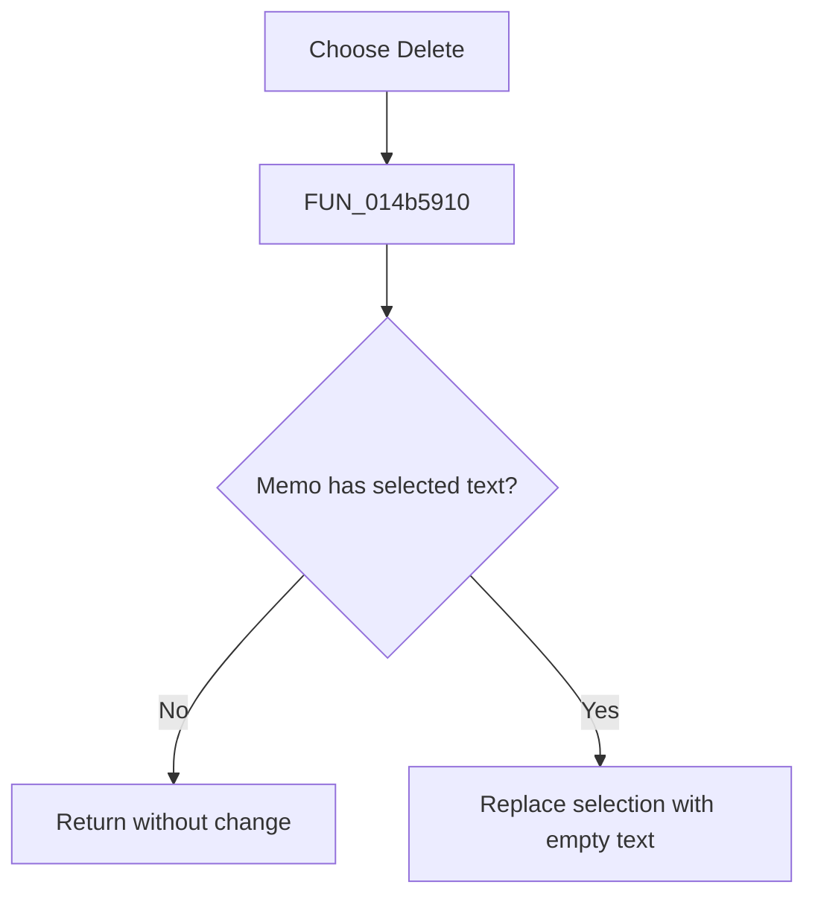

# &Delete

> Analysis status: Reviewed from the recovered handler and SynEdit selection-delete path.

## Control

| Property | Recovered value |
| --- | --- |
| Form | NetlistViewer |
| Component path | NetlistViewer.MainMenu.MEdit.MIDelete |
| Control class | TMenuItem |
| Caption | &Delete |
| Hint | Not present in the recovered resource. |
| Text | Not present in the recovered resource. |
| Handler name | MIDeleteClick |
| Handler address | 014b5910 |
| Graph node | `resource:dfm:NetlistViewer/NetlistViewer.MainMenu.MEdit.MIDelete` |
| Handler node | `function:014b5910` |
| Graph layer | UI |

## What happens when clicked

The menu item deletes the current `Memo` selection by replacing it with empty text. The helper first tests whether a selection exists. With no selection, it returns without changing the document. Unlike Cut, this path does not write the clipboard. The SynEdit replacement path owns modified-state and undo recording.

## Click flow

## Handler evidence

- Source: [DecompiledSources/Tina16/functions/00000000014B5910__FUN_014b5910.c](../../../DecompiledSources/Tina16/functions/00000000014B5910__FUN_014b5910.c)
- Recovered role: Delete the selected Netlist Viewer text without copying it.
- Current graph summary: Handles 1 Delphi UI event: NetlistViewer.MainMenu.MEdit.MIDelete.OnClick.
- Current graph behavior: Not present in the recovered resource.
- Current graph evidence: Not present in the recovered resource.
- Complexity: simple
- Distinct outgoing calls: 1

## Direct calls

- `function:00c08110` — FUN_00c08110

## Resource evidence

- Kind: Not present in the recovered resource.
- Modal result: Not present in the recovered resource.
- Checked state: Not present in the recovered resource.
- List items: Not present in the recovered resource.
- Image reference: Not present in the recovered resource.
- Extracted glyph: None.

## Nearby label candidates

Nearby labels are layout candidates only. They are not proof of behavior.

- No same-parent label candidate is available.

## Analysis limits

- The recovered wrapper does not contain its own read-only or error branch; those checks belong to the SynEdit replacement helper.
- The command does not delete a character when there is no selection.
